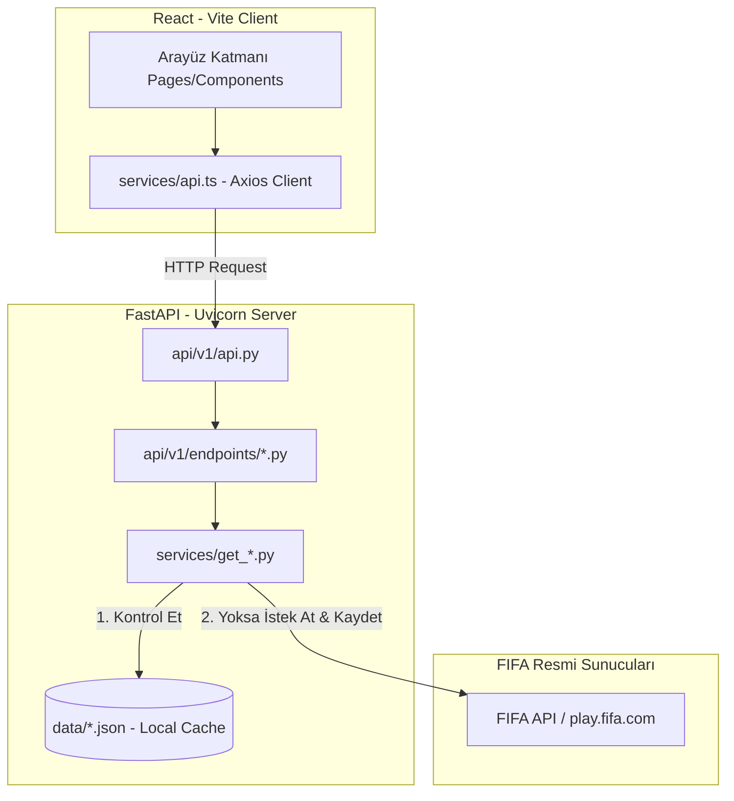
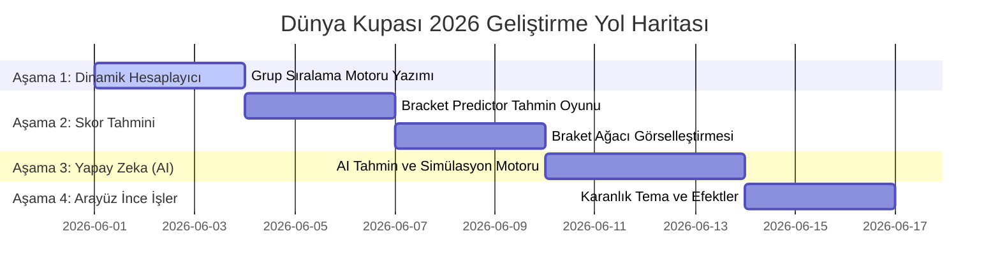

# 📋 Follow The World Cup 2026 - Proje Haritası ve Mimari Raporu

Bu doküman, Kanada, Meksika ve ABD ev sahipliğindeki **FIFA Dünya Kupası 2026** turnuvasını takip etmek amacıyla geliştirdiğimiz **FollowTheWorldCup** uygulamasının mevcut mimari haritasını, veri akışını, dosya sorumluluklarını ve geleceğe yönelik geliştirme yol haritasını içermektedir.

Uygulamamız, modern yazılım prensiplerine uygun olarak **gevşek bağlı (decoupled)**, **modüler** ve **performans odaklı** bir yapıda tasarlanmıştır.

---

## 🏗️ 1. Genel Sistem Mimarisi ve Çalışma Mantığı

Uygulamanın genel çalışma prensibi, resmi FIFA sunucularına aşırı yüklenmeden dolayı oluşabilecek **hız sınırlamalarını (rate-limiting)** ve **IP engellemelerini (IP bans)** önlemek amacıyla **Önbellek Öncelikli Yerel Yedekleme (Offline-First Cache System)** mimarisi üzerine kurulmuştur.



### Temel Çalışma Akışı:
1.  **Frontend (React):** Kullanıcı bir sayfayı açtığında (`Teams`, `Groups` veya `Matches`), frontend modülü Axios servisimiz (`services/api.ts`) aracılığıyla backend'e istek gönderir.
2.  **Backend (FastAPI):** İlgili endpoint (`/teams`, `/rounds` veya `/squads`), hizmet veren servis fonksiyonunu çağırır.
3.  **Yerel Kontrol (0ms Gecikme):** Servis, `app/data/` altındaki ilgili önbellek dosyasının (`fifa_data.json`, `rounds.json` veya `squads.json`) diskte olup olmadığını kontrol eder:
    *   **Önbellek VARSA (Offline Mod):** Veri anında diskten okunur ve frontend'e iletilir. FIFA API'sine hiçbir istek atılmaz. Gecikme 0 milisaniyedir.
    *   **Önbellek YOKSA (Online Mod):** Servis, resmi FIFA API'sine bağlanır, taze veriyi çeker, gelecekteki istekler için diske kaydeder ve ardından frontend'e gönderir.

---

## 📂 2. Backend Dizin Yapısı ve Dosya Analizleri

Backend, FastAPI çatısı (framework) altında Docker konteyneri olarak ayağa kalkmaktadır. Kod yapısı oldukça temiz ve modülerdir:

```text
backend/app/
├── api/
│   ├── v1/
│   │   ├── endpoints/
│   │   │   ├── health.py        # Sistem durum kontrolü (Health check)
│   │   │   ├── rounds.py        # Fikstür ve tur verisi endpoint'i (/rounds)
│   │   │   ├── squads.py        # Takım grup durumları endpoint'i (/squads)
│   │   │   └── teams.py         # Resmi takım marka ve logo endpoint'i (/teams)
│   │   └── api.py               # Alt yönlendiricilerin (routers) birleştirildiği dosya
│   └── deps.py                  # Bağımlılıkların (dependencies) yönetildiği dosya
├── core/
│   └── config.py                # Sunucu global ayarları ve CORS politikaları
├── data/
│   ├── fifa_data.json           # [CACHE] Takım renkleri ve logoları
│   ├── rounds.json              # [CACHE] Fikstür maç listesi ve turlar
│   └── squads.json              # [CACHE] Puan durumları ve torba bilgileri
├── services/
│   ├── get_rounds.py            # Fikstür çeken cache-first servis
│   ├── get_squads.py            # Puan durumu çeken cache-first servis
│   └── get_teams.py             # Ülke kartlarını çeken cache-first servis
└── main.py                      # FastAPI uygulamasını başlatan ana dosya
```

### Kritik Backend Dosyalarının Görevleri:
*   **[main.py](file:///c:/Users/ozzenc/Desktop/follow_the_world_cup/backend/app/main.py):** API uygulamasını ilklendirir, CORS politikalarını düzenler (frontend'in port `5173`'ten gelen isteklerine izin verir) ve `/api/v1` router'ını bağlar.
*   **[services/get_teams.py](file:///c:/Users/ozzenc/Desktop/follow_the_world_cup/backend/app/services/get_teams.py):** FIFA Plus resmi teams modülüne (`cxm-api.fifa.com`) bağlanarak takımların bayrak şablonlarını, geçmiş Dünya Kupası katılımlarını (`appearances`) ve resmi forma/marka renk kodlarını (`teamEnrichmentData`) çeker.
*   **[services/get_rounds.py](file:///c:/Users/ozzenc/Desktop/follow_the_world_cup/backend/app/services/get_rounds.py):** Fikstür ve maç takvimini resmi `play.fifa.com` tahminci API'sinden çeker. Toplam 8 turu (3 grup turu + 5 eleme turu) yönetir.
*   **[services/get_squads.py](file:///c:/Users/ozzenc/Desktop/follow_the_world_cup/backend/app/services/get_squads.py):** Kura torba (seed) verilerini ve grup istatistik başlangıç değerlerini çeker.

---

## 📂 3. Frontend Dizin Yapısı ve Dosya Analizleri

Frontend, **Vite + React + TypeScript** tabanlıdır ve modüler CSS altyapısına sahiptir. Arayüzün karmaşıklaşmasını önlemek amacıyla `main.tsx` ve `App.tsx` olabildiğince sade tutulmuştur.

```text
frontend/src/
├── components/
│   ├── Footer.tsx               # Geliştirici bilgileri, sosyal linkler ve bağış alanı
│   └── Navbar.tsx               # Animasyonlu Dropdown içeren responsive başlık menüsü
├── pages/
│   ├── About.tsx                # Dünya Kupası 2026 hakkında genel bilgilerin olduğu sayfa
│   ├── Contact.tsx              # İletişim formu ve destek alanı
│   ├── Groups.tsx               # 12 grubun puan durumlarını ve kısaltmalarını gösteren sayfa
│   ├── Home.tsx                 # Karşılama, animasyonlu tanıtım ve yönlendirme sayfası
│   ├── Matches.tsx              # Tarih ve stadyum detaylı grup/eleme fikstür sayfası
│   └── Teams.tsx                # Ev sahipleri ve konfederasyon filtreli takım listesi
├── services/
│   └── api.ts                   # Ortak Axios HTTP istemcisi (base VITE_API_URL)
├── App.tsx                      # Hash Router ve ana sayfa şablonu (Layout Wrapper)
├── App.css                      # Temel animasyon sınıfları (fadeIn vb.)
├── index.css                    # Sıfırlama ve genel font atamaları
└── main.tsx                     # React uygulamasını başlatan kök dosya
```

### Kritik Frontend Dosyalarının Görevleri:
*   **[App.tsx](file:///c:/Users/ozzenc/Desktop/follow_the_world_cup/frontend/src/App.tsx):** Gelişmiş ve kararlı bir **Hash-based Router** yapısı içerir (`#/home`, `#/teams`, `#/groups`, `#/matches` vb.). Sayfa yenilense dahi kullanıcının kaldığı rotayı korur.
*   **[pages/Teams.tsx](file:///c:/Users/ozzenc/Desktop/follow_the_world_cup/frontend/src/pages/Teams.tsx):** `/teams` endpoint'inden gelen marka renklerini kullanarak **dinamik markalı kartlar** çizer. Her ülkenin kartı kendi milli renklerine bürünür.
*   **[pages/Groups.tsx](file:///c:/Users/ozzenc/Desktop/follow_the_world_cup/frontend/src/pages/Groups.tsx):** Hem `/teams` hem de `/squads` API'lerini eşzamanlı çekerek, takım logolarını gruptaki güncel oynanan maç, averaj ve puanlarıyla harmanlar.
*   **[pages/Matches.tsx](file:///c:/Users/ozzenc/Desktop/follow_the_world_cup/frontend/src/pages/Matches.tsx):** Fikstürü turlara (Grup turları ve eleme aşamaları) bölerek şık kartlar halinde listeler. Eşleşmemiş eleme turları için otomatik bekleme şablonu sunar.

---

## 🔀 4. Kritik Veri Eşleştirme ve Entegrasyon Matrisi

Farklı FIFA API'lerinden veri çektiğimiz için sistemde iki farklı veri şeması bulunmaktadır. Eşleştirme sistemimiz bu uyuşmazlığı kusursuz şekilde yönetir:

| Parametre / Özellik | `/teams` (FIFA Plus API) | `/squads` & `/rounds` (Predictor API) | Entegrasyon Çözümümüz |
| :--- | :--- | :--- | :--- |
| **Benzersiz ID Şeması** | Global UUID/Sayı (`"43922"`, `"43924"`) | Basit tamsayı (`1` ile `48` arası) | Veriler birleştirilirken **Ülke Adı (name)** anahtar olarak kullanılır. |
| **Bosna-Hersek İsmi** | `"Bosnia and Herzegovina"` | `"Bosnia-Herzegovina"` | `s.name === "Bosnia-Herzegovina"` kontrolü yapılarak `"Bosnia and Herzegovina"` değerine dinamik map'lenir. |
| **Ülke Kısaltmaları** | Bulunmuyor | `abbr` alanı (`"TUR"`, `"ARG"`) | Grup tablolarına ve takımlara bu kısaltmalar dahil edilmiştir. |

---

## 🚀 5. Gelecek Yol Haritası ve Geliştirilecek Özellikler (Roadmap)

Raporumuza göre önümüzdeki süreçte sırasıyla şu premium özellikleri uygulayarak geliştirmeye devam edeceğiz:



### 1️⃣ Canlı Puan Durumu Sıralama Motoru (Standings Calculator)
*   **Mevcut Durum:** Puan tablolarında `OM`, `Averaj` ve `Puan` değerleri `squads.json` dosyasından geliyor ancak turnuva başlamadığı için sıfır görünüyor.
*   **Plan:** Backend veya frontend tarafında `rounds.json` içindeki maç skorlarını okuyarak puanları dinamik hesaplayan bir fonksiyon yazılacak. Bu sayede biz skor girdikçe (veya FIFA skor girdikçe) tablolar otomatik güncellenip sıralanacak.

### 2️⃣ Skor Tahmin Oyunu ve Simülatör (Bracket Predictor)
*   Kullanıcıların grup maçlarının skorlarını tahmin edebileceği şık tahmin kartları tasarlanacak.
*   Kullanıcının girdiği tahminlere göre puan durumu hesaplanacak ve her gruptan yükselen ilk 2 takım **otomatik olarak** Son 32 (R32) eşleşmelerine yerleştirilecek.
*   Eleme turları boyunca büyük finale kadar giden şık bir turnuva ağacı (Bracket Tree) çizilecek.

### 3️⃣ AI Destekli Maç Tahmin Modülü (AI Prediction Engine)
*   Takımların FIFA dünya sıralaması, geçmiş katılımları (`appearances`) ve torba güç dengelerini kullanarak yapay zeka tabanlı bir **galibiyet ihtimali hesaplayıcısı** oluşturulacak (Örn: Türkiye %45 kazanır, İtalya %35 kazanır, Beraberlik %20).

### 4️⃣ Karanlık Tema ve Mikro-Etkileşimler (Dark Mode & Micro-Animations)
*   Açık rengin yanında gözü yormayan premium bir koyu tema (Dark Mode) seçeneği eklenecek.
*   Maç sonuçlarına ve tahminlere özel parıltı (glow), cam (glassmorphism) ve geçiş efektleri yerleştirilecek.
