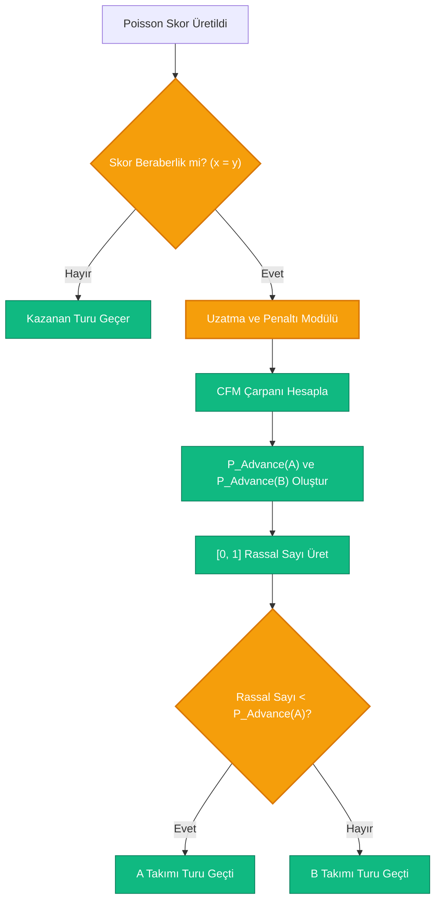

# 🤖 AI Tahmin ve Senaryo Simülasyon Motoru (Blueprint v2.0)
## FollowTheWorldCup.com Ürün, Matematik ve Sistem Mimarisi Tasarımı

Bu rapor; **FollowTheWorldCup.com** projesine entegre edilecek olan, kullanıcıların maç sonuçlarına müdahale ederek turnuva ağacındaki olasılıkların nasıl değiştiğini inceleyebileceği (What-If Senaryoları) ve yapay zeka destekli futbol analizi alabileceği **AI Tahmin ve Senaryo Simülasyon Motoru**'nun matematiksel, algoritmik ve veri mimarisi katmanlarını detaylandırmaktadır. 

*Bu versiyon (v2.0), Poisson dağılımının düşük skor zafiyetini gideren Dixon-Coles düzeltmelerini, eleme turları için beraberlik çözücü algoritmaları ve gerçek dünya veri tedariği kısıtlarını çözen statik enjeksiyon mimarisini içermektedir.*

---

## 1. Veri Tedariği ve Statik Enjeksiyon Mimarisinden (Static Ingestion) Beslenme

Canlı veri tedariğindeki API hız sınırları, Transfermarkt'ın anlık veri çekmeye izin vermeyen scraping engelleri ve canlı Elo servislerinin kararsızlıkları nedeniyle **FollowTheWorldCup.com**, canlı API çağrılarına bağımlı olmayan bir **Static Data Injection** mimarisi kullanır.

### A. Mimari Akış ve `team_stats.json` Çözümü

Canlı veri çekmek yerine, turnuva başlamadan hemen önce tek seferlik (veya haftalık aralıklarla arka planda cron-job olarak) çalışan bir **Scraper / Data Compiler Script** (`scrape_team_stats.py`) çalıştırılır. Bu script, Transfermarkt ve Elo web sitelerinden gerekli verileri toplayıp işler ve projenin backend katmanındaki yerel bir statik JSON dosyasına kaydeder.

```mermaid
graph LR
    classDef source fill:#64748B,stroke:#334155,stroke-width:1px,color:#fff;
    classDef process fill:#10B981,stroke:#047857,stroke-width:2px,color:#fff;
    classDef storage fill:#F59E0B,stroke:#D97706,stroke-width:1px,color:#fff;

    TM["Transfermarkt Scraper"]:::source --> Comp["Data Compiler Script"]:::process
    Elo["Elo Rating Parser"]:::source --> Comp
    Comp -->|"Masaüstü/Yerel Derleme"| JsonFile["team_stats.json"]:::storage
    
    subgraph FastAPI Backend (Production)
        JsonFile -->|"Startup'ta Hafızaya Okuma"| FastAPI["Memory Cache (In-Memory GPI)"]:::process
        FastAPI --> API["FastAPI Predictor Endpoint"]:::process
    end
```

### B. `team_stats.json` Şema Yapısı

Derlenen statik veri dosyası, backend ayağa kalktığında `@app.on_event("startup")` aşamasında tek seferde hafızaya (RAM) yüklenerek simülasyonların **sıfır veritabanı gecikmesiyle (<5ms)** çalışmasını sağlar.

```json
{
  "last_updated": "2026-05-30T10:30:00Z",
  "teams": {
    "ARG": {
      "team_name": "Argentina",
      "confederation": "CONMEBOL",
      "elo_rating": 2140,
      "squad_value_million_eur": 850.5,
      "recent_form_score": 16,
      "world_cup_appearances": 18,
      "world_cup_titles": 3,
      "is_host": false
    },
    "TUR": {
      "team_name": "Turkey",
      "confederation": "UEFA",
      "elo_rating": 1785,
      "squad_value_million_eur": 320.0,
      "recent_form_score": 12,
      "world_cup_appearances": 2,
      "world_cup_titles": 0,
      "is_host": false
    }
  }
}
```

---

## 2. Gelişmiş Matematiksel Modelleme (General Power Index & Dixon-Coles Poisson)

Her takım için nihai bir **Milli Takım Güç Endeksi (General Power Index - $GPI$)** yerel `team_stats.json` verilerinden beslenerek hesaplanır.

### A. Matematiksel Formülasyon: Takım Güç Endeksi ($GPI$)

$$GPI = 0.40 \cdot \overline{R}_{Elo} + 0.20 \cdot \overline{V}_{Squad} + 0.20 \cdot \overline{F}_{Form} + 0.15 \cdot \overline{H}_{Hist} + 0.05 \cdot HA$$

*(Burada parametreler $[0, 100]$ aralığına normalize edilmiştir. Ev sahibi ülkeler için $HA=1$, diğerleri için $0$'dır).*

---

### B. Düşük Skor Zafiyetini Çözen Dixon-Coles Poisson Modellemesi

Klasik Poisson dağılımı bağımsız gol beklentilerini modelediğinden, futboldaki **0-0 ve 1-1** gibi düşük skorlu beraberliklerin olasılıklarını gerçekte olduğundan daha düşük hesaplama eğilimindedir. Bu zafiyeti aşmak için modele **Dixon-Coles Düzeltmesi (Dixon-Coles Adjustment)** entegre edilmiştir.

1.  **Beklenen Gol Değerleri ($\lambda_A$ ve $\lambda_B$):**
    *   $\lambda_A = Baseline\_Goals \cdot \left(\frac{GPI_A}{GPI_{Average}}\right) \cdot \left(\frac{100 - GPI_B}{100}\right)$
    *   $\lambda_B = Baseline\_Goals \cdot \left(\frac{GPI_B}{GPI_{Average}}\right) \cdot \left(\frac{100 - GPI_A}{100}\right)$
    *(Baseline_Goals sabiti $2.6$ olarak ayarlanmıştır).*

2.  **Dixon-Coles Olasılık Matrisi Formülü:**
    Normal Poisson olasılık matrisi ($P(x, y)$) hesaplandıktan sonra, düşük skorlar için bir bağımlılık çarpanı ($\tau(x, y)$) uygulanır:

    $$P_{Adjusted}(X = x, Y = y) = \tau(x, y) \cdot P_{Poisson}(X = x, Y = y)$$

    Burada **Dixon-Coles $\tau(x,y)$ düzeltme katsayıları** şu şekildedir:
    *   **0 - 0 Beraberlik Durumu:** $\tau(0, 0) = 1 - \rho \cdot \lambda_A \cdot \lambda_B$
    *   **1 - 0 Durumu:** $\tau(1, 0) = 1 + \rho \cdot \lambda_B$
    *   **0 - 1 Durumu:** $\tau(0, 1) = 1 + \rho \cdot \lambda_A$
    *   **1 - 1 Beraberlik Durumu:** $\tau(1, 1) = 1 - \rho$
    *   **Diğer Tüm Skorlar:** $\tau(x, y) = 1$

    *(Burada $\rho$ korelasyon parametresi olup, uluslararası kupa finalleri standartlarında **$\rho = -0.06$** olarak kalibre edilmiştir. Bu kalibrasyon, 0-0 ve 1-1 skorlarının olasılıklarını **taktiksel gerçekliğe uygun olarak yaklaşık %+5 ila %+8 bandında yukarı yönlü** düzeltir ve matris nihai olarak tekrar normalize edilir).*

---

## 3. Eleme Maçlarında Beraberlik Çıkmazı Çözümü (Knockout Tie-Breaker)

Grup aşamalarında Dixon-Coles ile düzeltilmiş Poisson matrisindeki beraberlik olasılığı ($P_{Draw}$) kabul edilebilirdir. Ancak **Son 32, Son 16, Çeyrek Final, Yarı Final ve Final** gibi eleme (Knockout) aşamalarında bir takım turu geçmek zorundadır.

### A. Uzatma ve Penaltılar Karar Çarpanı (Coin-Flip Modifier - $CFM$)

Eğer eleme turlarındaki simülasyonda Poisson matrisi sonucu **beraberlik** (draw) olarak üretilirse, maç doğrudan "Uzatma ve Penaltı Atışları" döngüsüne girer. Bu döngüde, rastgele yazı-tura atmak yerine daha güçlü olan takıma tecrübe, yedek kulübesi kalitesi ve baskı yönetimini temsilen **Hafif Olasılık Avantajı** tanımlanır.



### B. $CFM$ ve Turu Geçme Formülasyonu

A ve B takımı arasındaki bir eleme maçı berabere bittiğinde, **A takımının turu geçme olasılığı ($P_{Advance}(A)$)** şu formülle belirlenir:

$$P_{Advance}(A) = 0.50 + CFM$$

Burada **Coin-Flip Çarpanı ($CFM$)**, iki takımın $GPI$ farkına göre dinamik olarak hesaplanan ve daha güçlü takıma **maksimum %60 olasılık tavanı** koyan bir çarpan parametresidir:

1.  Eğer $GPI_A \ge GPI_B$ ise:
    $$CFM = \min\left(0.10, \frac{GPI_A - GPI_B}{250}\right)$$
    $$P_{Advance}(A) = 0.50 + CFM$$
    $$P_{Advance}(B) = 1.0 - P_{Advance}(A)$$
2.  Eğer $GPI_B > GPI_A$ ise:
    $$CFM = \min\left(0.10, \frac{GPI_B - GPI_A}{250}\right)$$
    $$P_{Advance}(B) = 0.50 + CFM$$
    $$P_{Advance}(A) = 1.0 - P_{Advance}(B)$$

*Bu formülasyon sayesinde, iki güç dengesi tamamen eşit takımın beraberliğinde turu geçme şansı **%50-%50** iken; örneğin Arjantin ile Türkiye berabere kalırsa, Arjantin'in penaltılarda turu geçme şansı **%56 ila %58** bandına yükselir. Bu, turnuva gerçekliğini simülatörde birebir canlandırır.*

---

## 4. Yapay Zeka (LLM) Semantik Katmanı ve Prompt Tasarımı

Simülasyon motorundan çıkan sayısal farkları akıcı, coşkulu ve taktiksel bir spor analizine dönüştüren katmandır.

```json
{
  "scenario_metadata": {
    "user_action": "Türkiye'nin F Grubu'nu 1. sırada tamamlaması kilitlendi.",
    "affected_team": "Türkiye",
    "base_state_ranking": 32,
    "current_date": "2026-05-30"
  },
  "simulation_deltas": {
    "round_of_16_probability": {"before": "31.2%", "after": "64.8%", "delta": "+33.6%"},
    "quarter_final_probability": {"before": "12.0%", "after": "28.5%", "delta": "+16.5%"},
    "champion_probability": {"before": "0.3%", "after": "1.1%", "delta": "+0.8%"}
  },
  "bracket_pathway_changes": {
    "previous_path": {
      "round_of_16_potential_opponents": ["Brezilya (Grup E 1.si)", "İspanya (Grup E 2.si)"],
      "difficulty_rating": "Çok Zor (Kabus Yolu)"
    },
    "new_path": {
      "round_of_16_potential_opponents": ["Ekvador (Grup G 2.si)", "Galler (Grup G 3.sü)"],
      "difficulty_rating": "Orta Dengeli (Fırsat Yolu)"
    }
  }
}
```

LLM bu girdileri yorumlarken, Dixon-Coles sayesinde daha yüksek doğrulukla hesaplanmış beraberlik/skor olasılıklarını analiz ederek kullanıcıya gerçekçi bir futbol diliyle sunar.

---

## 5. Adım Adım Geliştirme Yol Haritası (Roadmap v2.0)

Mühendislik ekibinin FastAPI ve React tarafında sırayla yapacağı işlerin revize edilmiş yol haritası:

### 🗓️ FAZ 1: Statik Veri & Matematik Servisleri (Hafta 1)
*   **Adım 1 (Scraper Script):** `scripts/scrape_team_stats.py` scriptini hazırlayın. Transfermarkt ve güncel Elo verilerini çekerek backend içerisindeki `app/data/team_stats.json` dosyasına statik olarak yazdırın.
*   **Adım 2 (FastAPI Startup):** FastAPI uygulamasının startup aşamasında (`@app.on_event("startup")`) `team_stats.json` dosyasını RAM'e yükleyerek global bir Python sözlüğünde (`TEAM_STATS_CACHE`) önbelleğe alın.
*   **Adım 3 (Dixon-Coles & Poisson):** İki takım arasında Poisson gol matrisini oluşturan, ardından Dixon-Coles ($\rho = -0.06$) formülüyle 0-0 ve 1-1 ihtimallerini revize edip normalize eden `/api/v1/predict/match` API endpoint'ini yazın.

### 🗓️ FAZ 2: Monte Carlo Ağacı & Beraberlik Çözücü Entegrasyonu (Hafta 2)
*   **Adım 4 (FastAPI Simülatör):** Turnuva ağacını dolaşan (Bracket Traversal) Monte Carlo simülasyon kodunu Python'da yazın. Düğümlerin grup sıralamalarını ve kullanıcı kilitlerini okuyun.
*   **Adım 5 (Knockout Tie-Breaker):** Simülasyon döngüsü içerisine eleme maçları için beraberlik denetleyicisi ekleyin. Skor eşitliğinde ($x=y$) iki takımın $GPI$ farkına göre $CFM$ çarpanını uygulayarak turu geçen takımı NumPy üzerinde simüle edin.
*   **Adım 6 (React):** Arayüze interaktif kilit butonları ekleyerek, kullanıcının fikstür sayfasındaki seçimlerini backend endpoint'ine post etmesini sağlayın ve olasılık değişimlerini açık tema glassmorphism barlarında animasyonlu gösterin.

### 🗓️ FAZ 3: LLM Spor Analisti Entegrasyonu (Hafta 3)
*   **Adım 7 (Yapay Zeka Servisi):** Simülasyondan çıkan verileri prompt context formatına derleyen yapıyı FastAPI'de kurun. OpenAI GPT-4o API'sine "AI Santra" promptuyla çağrı yaparak üretilen taktiksel yorumu React arayüzünde şık bir "AI Yorum Odası" paneliyle kullanıcıya sunun.
