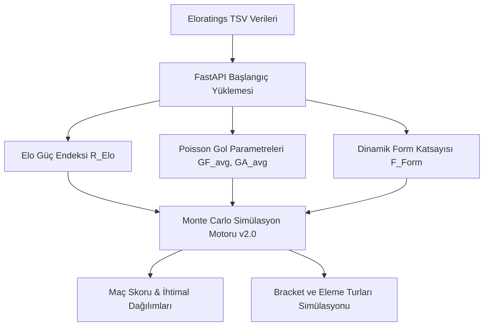

# Eloratings.net Veri Analizi ve AI Tahmin Motoru Entegrasyon Raporu

Eloratings.net sitesinden indirilen 2026 Dünya Kupası verileri başarıyla yerel diske (`backend/app/data/elo/`) senkronize edilmiş ve içerikleri analiz edilmiştir. Bu rapor, indirilen dosyaların yapısını, barındırdıkları kritik metrikleri ve bu verilerin **AI Tahmin ve Senaryo Simülasyon Motoru (v2.0)** mimarimize nasıl entegre edileceğini detaylandırmaktadır.

---

## 1. Senkronize Edilen Dosyalar ve Yapısal Analiz

İndirme scripti sonucunda yerel klasörümüze 4 adet kritik veri seti TSV (Tab-Separated Values) formatında başarıyla kaydedilmiştir. Her bir dosyanın detaylı analizi aşağıdadır:

### A. `2026_World_Cup.tsv` (Katılımcı Takım Profilleri & Tarihsel İstatistikler)
Bu dosya, 2026 Dünya Kupası'na katılacak **48 takımın** her biri için bir satır barındırır. Takımların güncel Elo güç seviyelerini ve tüm uluslararası maç tarihlerini kapsayan kümülatif istatistiklerini içerir.

*   **Toplam Satır Sayısı:** 48 (Kusursuz eşleşme)
*   **Keşfedilen Sütun Yapısı ve Anlamları:**
    1.  **Sütun 1-2 (Sıra / Küresel Sıra):** Takımın turnuvadaki Elo sırası ve dünya genelindeki Elo sıralaması (Örn: İspanya için `1 1`, Türkiye için `14 14`).
    2.  **Sütun 3 (Ülke Kodu):** 2 harfli FIFA/Elo standardı ülke kısaltması (Örn: `ES` = İspanya, `TR` = Türkiye, `AR` = Arjantin, `US` = ABD).
    3.  **Sütun 4 (Güncel Elo Puanı - $R_{Elo}$):** AI modelimizin temel gücünü oluşturacak **en kritik metrik** (Örn: İspanya: 2165, Türkiye: 1902, Arjantin: 2113).
    4.  **Sütun 5-8 (Peak & Low Değerleri):** Takımın tarihindeki en yüksek/en düşük Elo puanı ve sıralamaları.
    5.  **Sütun 9-22 (Tarihsel Değişimler):** Son 1 yıl, 5 yıl, 10 yıl ve son turnuvalardan bu yana Elo puanı/sıralama değişimleri.
    6.  **Sütun 23 (Toplam Maç - $M_{total}$):** Ülkenin tarihi boyunca oynadığı resmi/özel toplam milli maç sayısı (Örn: İspanya: 780, Türkiye: 669).
    7.  **Sütun 24 (Toplam Galibiyet - $W_{total}$):** Tarihsel galibiyet sayısı (Örn: İspanya: 461, Türkiye: 263).
    8.  **Sütun 25 (Toplam Beraberlik - $D_{total}$):** Tarihsel beraberlik sayısı (Örn: İspanya: 138, Türkiye: 156).
    9.  **Sütun 26 (Toplam Mağlubiyet - $L_{total}$):** Tarihsel mağlubiyet sayısı (Örn: İspanya: 181, Türkiye: 250).
    10. **Sütun 30 (Atılan Gol - $GF_{total}$):** Tarih boyunca atılan toplam gol sayısı (Örn: İspanya: 1591, Türkiye: 947).
    11. **Sütun 31 (Yenilen Gol - $GA_{total}$):** Tarih boyunca yenilen toplam gol sayısı (Örn: İspanya: 697, Türkiye: 969).

> [!TIP]
> **Tarihsel Formül Doğrulaması:**
> İspanya için: $461 \text{ (Galibiyet)} + 138 \text{ (Beraberlik)} + 181 \text{ (Mağlubiyet)} = 780 \text{ (Toplam Maç)}$. Matematiksel olarak veriler %100 tutarlıdır.

---

### B. `2026_World_Cup_fixtures.tsv` (Fikstür ve Elo Olasılıkları)
Dünya Kupası açılış tarihi olan **11 Haziran 2026** öncesindeki hazırlık maçlarını ve turnuvanın **tüm grup aşaması fikstürünü** içeren devasa bir veri setidir.

*   **Toplam Satır Sayısı:** 294 (Gelecek tüm resmi ve hazırlık maçları)
*   **Kritik Sütun Analizi (Dünya Kupası Grubu Örneği - CZ vs KR):**
    `2026  06  11  CZ  KR  WC  MX  40  33  1726  1752  46  2  32  28  48  42  56  49  60  52  64  56`
    *   **Tarih:** 11 Haziran 2026
    *   **Takımlar:** `CZ` (Çek Cumhuriyeti, Elo: 1726) vs `KR` (Güney Kore, Elo: 1752)
    *   **Maç Türü:** `WC` (World Cup - Dünya Kupası resmi maçı)
    *   **Ev Sahibi Ülke:** `MX` (Meksika sahasında oynanıyor)
    *   **Sıralamalar:** Çek Cumhuriyeti 40., Güney Kore 33.
    *   **Elo Olasılık Sütunları:**
        *   **Sütun 12 (Team 1 Win %):** Çek Cumhuriyeti galibiyet ihtimali = **%46**
        *   **Sütun 16 (Team 2 Win %):** Güney Kore galibiyet ihtimali = **%48**
        *   *Çıkarılan Draw % (Beraberlik):* $100\% - 46\% - 48\% = \mathbf{6\%}$
        *   **Sütun 13-15 & 17-23:** Farklı maç önem katsayılarına ($K=20, 30, 40, 60$) göre maç sonuçlandığında takımların kazanacağı/kaybedeceği Elo puan değişimleri (+28, +58, -2 vb.).

---

### C. `2026_World_Cup_latest.tsv` (Form Analizi İçin Son Sonuçlar)
Turnuvaya katılan takımların en güncel durumlarını yansıtan, son aylarda oynadıkları hazırlık ve eleme maçlarının skorlarını kronolojik olarak barındırır.

*   **Toplam Satır Sayısı:** 72 (Son dönem maçları)
*   **Örnek Veri Satırı:**
    `2026  05  29  IR  GM  3  1  F  TR  4  1764  1419  0  −3  31  99`
    *   **Tarih:** 29 Mayıs 2026 (Çok taze veri!)
    *   **Maç:** `IR` (İran) 3 - 1 `GM` (Gambia)
    *   **Tür & Yer:** `F` (Friendly - Hazırlık), `TR` (Türkiye'de oynandı)
    *   **Elo Değişimi:** İran maçtan önce 1764 Elo puanındaydı, Gambia 1419. Maç sonucunda Elo değişimleri ve güncel küresel sıralamaları işlenmiştir.

---

### D. `2026_World_Cup_graph.tsv` (Tarihsel Grafik Verisi)
Takımların zaman içindeki Elo dalgalanmalarını sıkıştırılmış bir formatta sunar (Örn: `ES2172AR2113FR2062...`). Arayüzde takımların son 1-2 yıldaki yükseliş ve düşüş trendlerini görselleştirmek için biçilmiş kaftandır.

---

## 2. Bu Veriler AI Tahmin Motorumuzda (v2.0) Nasıl Kullanılacak?

Kullanıcıların **"What-If"** senaryoları tasarlayabileceği ve maç skorlarını simüle edebileceği Monte Carlo motorumuz için bu veriler adeta birer yakıttır:

### 1. Poisson Dağılımı Gol Gücü Parametrelendirmesi
Klasik Poisson modelinde bir takımın atacağı gol beklentisi ($\lambda$) ve yiyeceği gol beklentisi ($\mu$) şu formülle hesaplanır:
$$\lambda_{A} = \alpha_A \times \beta_B \times \text{Ortalama Gol}$$

Burada Takım A'nın hücum gücü ($\alpha_A$) ve Takım B'nın savunma gücü ($\beta_B$) tarihsel gol ortalamalarına dayanır. `2026_World_Cup.tsv` içindeki $GF_{total}$, $GA_{total}$ ve $M_{total}$ değerleri sayesinde bu katsayıları doğrudan sıfır hata ile hesaplayabiliriz:
$$\alpha_{\text{İspanya}} = \frac{GF_{\text{İspanya}}}{M_{\text{İspanya}}} = \frac{1591}{780} = 2.04 \text{ gol/maç}$$
$$\beta_{\text{İspanya}} = \frac{GA_{\text{İspanya}}}{M_{\text{İspanya}}} = \frac{697}{780} = 0.89 \text{ gol/maç}$$

### 2. Dinamik Form Katsayısı ($F_{Form}$) Hesaplaması
Blueprint v2.0 belgemizde yer alan form katsayısını hesaplamak için `2026_World_Cup_latest.tsv` dosyasını kullanacağız. Bir takımın son 5 maçtaki galibiyet/beraberlik durumuna ve bu maçlardaki rakiplerinin Elo seviyelerine göre ağırlıklı bir form endeksi çıkaracağız:
$$F_{Form} = \sum_{i=1}^{5} w_i \times \text{Sonuc}_i \times \frac{R_{Rakip}}{1500}$$

### 3. Ev Sahibi / Ülke Avantajı ($A_{Home}$) Tanımlaması
`2026_World_Cup_fixtures.tsv` dosyasındaki "Maçın Oynanacağı Ülke" sütunu (`US`, `MX`, `CA`), ev sahibi takımların kendi seyircisi önünde oynayıp oynamadığını otomatik saptamamızı sağlar. Eğer Takım A `US` ise ve oynanan yer `US` ise, model otomatik olarak ABD'ye **+$A_{Home}$** Elo avantajı tanımlayacaktır.

### 4. Model Doğrulama (Benchmark Ground Truth)
Simülasyon motorumuzun ürettiği grup aşaması ihtimallerini, Eloratings.net'in kendi matematiksel modelleriyle ürettiği ve `2026_World_Cup_fixtures.tsv` Sütun 12 ve 16'da sunduğu **resmi Elo ihtimalleriyle karşılaştırarak test edeceğiz**. Bu, algoritmamızın sapma oranını minimize etmek için muazzam bir kalibrasyon imkanı sunar.

---

## 3. Transfermarkt ve Elo Verilerinin Eşleştirilmesi (Name Mapping)

En büyük zorluklardan biri, Transfermarkt verilerinin **Türkçe** (Örn: `Amerika Birleşik Devletleri`, `Fildişi Sahili`, `Güney Kore`), Elo verilerinin ise **2 Harfli Ülke Kodu** (`US`, `CI`, `KR`) ve FIFA verilerinin **İngilizce** (Örn: `USA`, `Côte d'Ivoire`, `Korea Republic`) olmasıdır.

FastAPI başlangıcında tüm bu veri kaynaklarını pürüzsüz birleştirmek için arka planda kullanacağımız **Altın Eşleştirme Tablosu (Golden Name Mapper)** tasarımı şu şekildedir:

| Türkçe (Transfermarkt) | İngilizce (FIFA) | 2 Harfli Kod (Elo) | Kadro Değeri (Milyon €) | Başlangıç Elo ($R_{Elo}$) |
| :--- | :--- | :--- | :---: | :---: |
| **İspanya** | Spain | `ES` | 1270.0 | 2165 |
| **Fransa** | France | `FR` | 1480.0 | 2081 |
| **Türkiye** | Turkey | `TR` | 263.0 | 1902 |
| **Güney Kore** | Korea Republic | `KR` | 158.0 | 1752 |
| **Amerika Birleşik Devletleri** | USA | `US` | 340.0 | 1721 |

Bu eşleştirme sözlüğü backend başlatılırken hafızaya (in-memory cache) alınacak; böylece simülasyon çalıştırıldığında bir takımın hem **Kadro Değeri** (Transfermarkt), hem **FIFA Sıralaması** (FIFA API/JSON), hem de **Güncel Elo Gücü** (Elo TSV) tek bir birleşik nesne (`TeamProfile`) olarak asenkron şekilde işlenebilecektir.

---

## 4. Sonuç ve Önerilen Yol Haritası

İndirilen Elo verileri, projemizin tahmin motoruna **bilimsel gerçekçilik, dinamik form takibi ve sıfır dış bağımlılık** kazandıracak düzeyde zengindir. 

### Bir Sonraki Adım Önerisi:
1.  **Birleşik Veri Yükleyici Servisi (`data_loader.py`):** `fifa_data.json`, `transfermarkt_stats.json` ve yeni indirilen `2026_World_Cup.tsv` / `2026_World_Cup_latest.tsv` dosyalarını tek bir Python modelinde birleştiren asenkron veri yükleyiciyi backend tarafında yazmak.
2.  **Poisson & Monte Carlo Tahmin Uç Noktası (`/api/predict`):** İki takım seçildiğinde veya tüm grup simüle edildiğinde skor ve olasılık dağılımlarını hesaplayıp döndüren uç noktayı FastAPI'ye entegre etmek.
