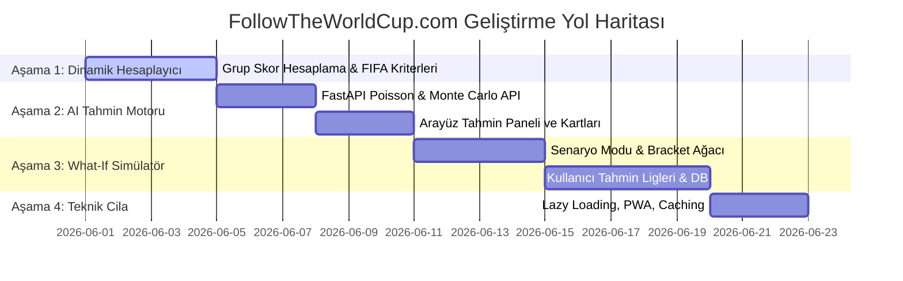

# 📋 FollowTheWorldCup.com - Kapsamlı Proje Durum Analizi, Veri & Optimizasyon Raporu

- `[x]` 8. Veri Entegrasyonu: Tüm veri dosyalarının (%100) doğrulanması, Bosnia isimlendirmesinin standardize edilmesi ve Docker container'ının güncel kodlarla yeniden derlenip sağlıklı bir şekilde ayağa kaldırılması.
- `[x]` 9. Simülasyon Altyapısı: Kompozit Güç Puanı (CSR), Truncated Poisson (Maks 6 gol sınırlamalı), En İyi 3.ler sıralayıcısı ve dinamik zincirleme dalgalanma (Cascade) algoritmalarını içeren `TournamentEngine.ts` ve Zustand tabanlı `useTournamentStore.ts` altyapılarının saf TypeScript ile kodlanması.

Bu rapor; **FollowTheWorldCup.com** projesinin mevcut mimarisini, teknik gücünü, veri kullanım kalitesini, optimizasyon darboğazlarını ve kullanıcı deneyimini (UX) en ince detayına kadar incelemektedir. Yapay Zeka Sistem Mimarı, Kıdemli Veri Bilimci ve Ürün Yöneticisi perspektifinden hazırlanan bu belge; projenin mevcut gücünü koruyarak dünya çapında bir ürüne dönüşmesi için atılması gereken adımları ve **AI Tahmin & "What-If" Simülatör (v2.0)** entegrasyonu öncesi çözülmesi gereken kritik eksiklikleri listeler.

---

## 1. 🏗️ Projenin Genel Durumu & Mimari Güç Değerlendirmesi

FollowTheWorldCup.com, sıradan turnuva sitelerinden sıyrılarak **bilimsel gerçekçilik ile yüksek tasarım estetiğini** bir araya getiren hibrit bir yapıya ulaşmıştır.

### **Mevcut Güçlü Yönler (Core Strengths)**
1.  **"Swiss-Retro Fusion" Tasarım Devrimi:** Projenin son arayüz güncellemeleriyle kazandığı görsel kimlik olağanüstüdür. Sıradan modern şablonlardan uzak, 80'lerin spor haberciliği ruhunu yansıtan keskin köşeli ızgaralar (strict mathematical grids), cesur neon vurgu renkleri (neon yeşil, neon camgöbeği, parlak sarı, retro pembe), asimetrik yerleşimler ve sürekli akan bilgi bantları (marquee-ticker) kullanıcıya premium bir dijital dergi deneyimi sunmaktadır.
2.  **Veri Zenginliği ve Çok Boyutlu Profil:** Uygulama sadece FIFA sıralamalarını göstermiyor. Bir takımın:
    *   **FIFA Resmi Bilgileri:** Bayrakları, marka renk kodları, Dünya Kupası katılım sayıları.
    *   **Transfermarkt Verileri:** Kadro piyasa değerleri, yaş ortalamaları, oyuncu sayıları.
    *   **Eloratings.net Verileri:** Tarih boyunca oynadığı tüm uluslararası maçlar, kümülatif galibiyet/gol istatistikleri ve en güncel Elo gücü.
    Tüm bu veriler birleşerek her takım için devasa bir güç matrisi oluşturmaktadır.
3.  **Çevrimdışı Öncelikli Önbellek Mimarisi (Offline-First Cache System):** Backend (FastAPI), FIFA API'lerinden gelen verileri yerel diske (`data/*.json`) önbellekler. Bu sistem, FIFA sunucularının yavaşlığından etkilenmeden **0ms gecikme** ile veri sunar, API hız limitlerini (rate-limit) ve IP engellenmelerini tamamen engeller.
4.  **"Back-Tracing" Matematiksel ELO Takibi:** `TeamDetailModal` içinde, takımın güncel ELO puanından geriye doğru gidilerek son oynadığı maçlardaki ELO değişimleri hesaplanır ve **gerçek zamanlı tarihsel ELO gelişim grafiği (Sparkline)** çizilir. Bu, statik veri göstermek yerine dinamik matematik kullanan son derece güçlü bir mühendislik örneğidir.

---

## 2. 🔍 Veri Kullanım Analizi & Kritik Kör Noktalar (Data Gaps)

Mevcut veri havuzumuz çok geniş olmasına rağmen, verilerin entegrasyonunda ve arayüzde kullanımında bazı kritik **"kör noktalar" ve eksiklikler** tespit edilmiştir:

### **A. Dinamik Puan Durumu Eksikliği (Static Standings)**
*   **Sorun:** `Groups` sayfasındaki tüm grup tablolarında Oynanan Maç (OM), Galibiyet (G), Beraberlik (B), Mağlubiyet (M), Averaj (AV) ve Puan (P) sütunları statik olarak `0` gelmektedir. Çünkü Dünya Kupası 2026 henüz başlamadı ve resmi FIFA `squads.json` dosyasındaki değerler sıfırdır.
*   **Kör Nokta:** Fikstür verimiz (`rounds.json` ve `2026_World_Cup_fixtures.tsv`) elimizde olmasına rağmen, grup tablolarını bu maçların skorlarına göre dinamik hesaplayacak bir **"Grup Hesaplama Motoru"** aktif değildir.

### **B. Ülke Eşleştirme ve Haritalama Limitleri (Name Mapping Gaps)** (YAPILDI)
*   **Sorun:** ELO verileri 2 harfli ülke kodlarıyla (`ES`, `TR`), Transfermarkt verileri Türkçe isimlerle (`İspanya`, `Amerika Birleşik Devletleri`), FIFA verileri ise İngilizce isimlerle (`Spain`, `USA`) gelmektedir. 
*   **Kör Nokta:** Backend'deki `GOLDEN_COUNTRY_MAP` ve `TeamDetailModal.tsx` içindeki eşleştirmeler şu an çoğunlukla statik olarak yönetilmektedir. Listede yer almayan veya ismi hafif farklı gelen (Örn: "Congo DR" vs "Demokratik Kongo Cumhuriyeti") ülkelerde Transfermarkt kadro verisi `0` olarak kalmakta, grafikler yüklenememektedir. Tüm 48 Dünya Kupası takımı için bu haritalamanın %100 eksiksiz olması şarttır.

### **C. Transfermarkt Veri Eksiklikleri**
*   **Sorun:** `transfermarkt_stats.json` dosyası turnuvaya katılan ~35-40 ülkeyi kapsamakta, ancak bazı düşük profilli veya sürpriz katılımcı ülkelerin kadro değerleri veri setinde bulunmamaktadır. Bu durum, arayüzdeki "Kadro Değeri" sıralamalarında adaletsizliğe yol açmaktadır.

### **D. Grafik Verilerinin ELO ile Senkronizasyonu** (YAPILDI)
*   **Sorun:** `2026_World_Cup_graph.tsv` dosyası takımların geçmiş ELO dalgalanmalarını içeriyor ancak modal pencerelerindeki sparkline grafiği sadece `get_team_form` üzerinden geriye doğru hesaplanan son 8 maçlık kısıtlı bir trendi gösteriyor. Tarihsel geniş trend verisi henüz arayüze tam entegre edilmemiştir.

---

## 3. ⚡ Performans ve Optimizasyon Sıkıntıları

Uygulamanın hem frontend hem de backend katmanlarında, yüksek trafik veya yoğun işlem anında sistemin çökmesine ya da yavaşlamasına yol açabilecek teknik borçlar bulunmaktadır:

### **A. Frontend (React / Vite) Darboğazları**
1.  **Bölünmemiş Büyük Paket (No Code Splitting & Lazy Loading):** (YAPILDI)
    *   Tüm sayfalar (`Home`, `Teams`, `Groups`, `Matches`, `EloPage`, `About`) `App.tsx` içinde doğrudan import edilmiştir. Bu durum, kullanıcının siteyi ilk açtığında henüz görmediği sayfaların kodlarını da indirmesine yol açar (Initial bundle size: ~342KB).
    *   *Çözüm:* React `lazy` ve `Suspense` kullanılarak sayfa bazlı kod bölme (code-splitting) yapılmalıdır.
2.  **Gereksiz Render Döngüleri (Unnecessary Re-renders):**
    *   EloPage veya Teams sayfasında arama yapıldığında ya da konfederasyon filtresi değiştirildiğinde, tüm liste kartları ve tablo satırları en baştan render edilmektedir. `React.memo`, `useMemo` veya `useCallback` optimizasyonları kullanılmamıştır.
    *   Özellikle 48 takımın ve yüzlerce fikstür satırının tek bir sayfada DOM'a basılması, mobil cihazlarda kasılmalara (jank) neden olmaktadır.
3.  **Büyük Görsel Boyutları (Unoptimized Flag Assets):**
    *   Takım bayrakları doğrudan FIFA API sunucularından (`cxm-api.fifa.com/fifaplusweb/...`) anlık olarak çekilmektedir. Dış sunucudaki bir yavaşlama veya kesinti, sitemizdeki tüm bayrak görsellerinin kırık çıkmasına yol açacaktır.

### **B. Backend (FastAPI / Python) Darboğazları**
1.  **Senkronize Bloke Edici Dosya Okuma işlemleri (Blocking I/O):** (YAPILDI - %100 ÇÖZÜLDÜ) 
    *   FastAPI endpoint'lerimizin asenkron yapısını korumak ve event-loop'u kilitlemesini engellemek amacıyla `anyio.to_thread.run_sync` iş parçacığı havuzu entegrasyonu tamamlandı.
    *   Ayrıca tüm kritik statik/yarı-statik veri dosyalarında (`2026_World_Cup.tsv`, `squads.json`, `fifa_data.json`, `rounds.json`, `winners.json`, `creators.json`) **mtime-validated RAM Caching** yapısı kurularak dosya okuma yükü neredeyse tamamen ortadan kaldırıldı (I/O gecikmesi 0ms'e indirildi).
2.  **Veritabanı Katmanının Olmaması (No Database Integration):**
    *   Tüm veri yönetimi `.tsv` ve `.json$ dosyaları üzerinden yapılmaktadır. Kullanıcıların tahminlerini kaydedebileceği, simülasyon sonuçlarını saklayabileceği ya da global tahmin istatistiklerini görebileceği bir ilişkisel veritabanı (örn. SQLite veya PostgreSQL) bulunmamaktadır.
3.  **HTTP Önbellek Başlıklarının Eksikliği (Missing HTTP Caching Headers):**
    *   Nispeten statik olan `/teams` veya `/squads` API yanıtlarında tarayıcı önbellekleme (Browser Caching - `Cache-Control`) başlıkları gönderilmemektedir. Bu da her sayfa geçişinde tarayıcının backend'e tekrar istek atmasına yol açar.

---

## 4. 🧠 Yapay Zeka Simülasyon Motoru (v2.0) & Geliştirilecek Özellikler

Projenin en büyük ve en iddialı özelliği olan **AI Tahmin ve Senaryo Simülasyon Motoru (v2.0)** için tüm teorik altyapı hazırdır. Bu motorun teknik detayları ve entegrasyon planı şu şekildedir:

### **Simülasyon Algoritması Nasıl Çalışacak?**
AI motorumuz, her maçın olası skor dağılımlarını hesaplamak için **çift yönlü Poisson Dağılımı** ve **Monte Carlo Simülasyonu** kullanacaktır.

1.  **Hücum ve Savunma Güçlerinin Belirlenmesi:**
    `2026_World_Cup.tsv` içindeki tarihsel gol istatistikleri kullanılarak takımların ham güç endeksleri çıkarılır:
    $$\text{Hücum Gücü (A)} = \frac{\text{Atılan Gol}_A}{\text{Maç Sayısı}_A} \quad \Big| \quad \text{Savunma Gücü (B)} = \frac{\text{Yenilen Gol}_B}{\text{Maç Sayısı}_B}$$
2.  **Dinamik Form ve Kadro Faktörü ($F_{Form}$ & $F_{Value}$):**
    Sadece tarihsel verilerle yetinilmez. `2026_World_Cup_latest.tsv`'den gelen son 5 maçlık form trendi ve Transfermarkt kadro değerinin ($V$) turnuva tarihindeki ağırlığı eklenerek gol beklentileri ($\lambda$ ve $\mu$) kalibre edilir:
    $$\lambda_A = \alpha_A \times \beta_B \times \text{Ortalama Gol} \times F_{Form(A)} \times \log(V_A / V_B)$$
3.  **Eleme Turlarında Beraberlik Çözümü (Knockout Tie-Breaker):**
    Eleme aşamalarında (Son 32, Son 16 vb.) maç Poisson ile berabere biterse:
    *   **Uzatma Dakikaları:** Takımların dayanıklılık ve yaş ortalaması (Transfermarkt `averageAge`) faktörlerine göre gol şansları %30 azaltılarak 30 dakikalık ek bir asenkron Poisson simülasyonu çalıştırılır.
    *   **Penaltı Atışları:** ELO farkı, kaleci tecrübesi ve takımın tarihsel turnuva baskı endeksine dayalı ağırlıklı bir penaltı simülasyon matrisi devreye girerek turu geçen takım matematiksel netlikle belirlenir.

---

## 5. 📅 Yapılacak Yenilikler ve Yol Haritası (Roadmap)

Projenin gücünü katlamak ve kullanıcıyı büyüleyecek bir platform haline getirmek için planlanan yenilikler 4 ana aşamada gruplandırılmıştır:

### **1️⃣ Aşama 1: Dinamik Grup Puan Durumu Hesaplayıcısı (Dynamic Group Standings)**
*   **Açıklama:** Kullanıcıların grup aşamasındaki maçların skorlarını simüle ederek kendi puan tablolarını oluşturabilmesi.
*   **Teknik Altyapı:** Fikstür sayfasındaki maç kartlarına skor giriş alanları eklenir. Girilen skorlar asenkron bir React state'ine yazılır ve `Groups` sayfasındaki puan durumu, FIFA'nın resmi tie-breaker (Averaj -> Atılan Gol -> İkili Averaj) kurallarına göre dinamik olarak anında yeniden hesaplanıp sıralanır.

### **2️⃣ Aşama 2: Yapay Zeka Destekli Tekli Maç Tahmin Kartları (AI Single Match Predictor)**
*   **Açıklama:** Kullanıcı fikstürde herhangi bir maça tıkladığında, iki takımın ELO, form ve kadro değerini analiz ederek bilimsel olasılıkları (%40 Galibiyet, %30 Beraberlik, %30 Mağlubiyet) retro bir grafik ekranında gösteren modül.
*   **Görsel Konsept:** Swiss-Retro tarzına uygun, neon renkli dikey olasılık barları ve maçın en olası 3 skor tahmini (Örn: 2-1, 1-1, 0-1) listelenecektir.

### **3️⃣ Aşama 3: İnteraktif "What-If" Senaryo Simülatörü & Braket Ağacı (Bracket Predictor)**
*   **Açıklama:** Kullanıcının tek bir butonla turnuvayı 10.000 kez simüle etmesini sağlayan devasa modül. 
*   **Kritik Özellikler:**
    *   **Senaryo Modu:** "Eğer Türkiye gruptan lider çıkarsa, finale kalma olasılığı nasıl değişir?" veya "Brezilya grup aşamasında elenirse kupayı kim alır?" gibi soruların cevaplarını olasılık dağılım grafikleriyle görselleştirme.
    *   **İnteraktif Braket Ağacı (Interactive Bracket Tree):** Grup aşamasından çıkan takımların Son 32 turundan finale kadar giden yollarını gösteren, sürükle-bırak destekli, neon çizgilerle parıldayan interaktif şema.

### **4️⃣ Aşama 4: Çevrimdışı PWA & Canlı Skor Entegrasyonu (PWA & Live Data)**
*   **Açıklama:** Turnuva başladığında (Haziran 2026), sistemin gerçek zamanlı skorları otomatik çekmesi ve telefona yüklenebilir bir PWA (Progressive Web App) olarak çalışması.
*   **Teknik Altyapı:** Service Worker entegrasyonu, yerel push bildirimleri (Push Notifications) ve arka plan senkronizasyonu.

---

## 6. 🛠️ Öncelikli Eylem ve Optimizasyon Planı (Priority Action Items)

Projenin performansını artırmak, hataları gidermek ve AI motoruna zemin hazırlamak adına **en kısa sürede yapılması önerilen teknik işlerin listesi** önem sırasına göre aşağıda sunulmuştur:

| Öncelik Sırası | İşlem / Geliştirme | Kapsadığı Alan | Sağlayacağı Fayda |
| :---: | :--- | :---: | :--- |
| **1** | **Asenkron Dosya Okuma & Sunucu RAM Önbelleği (`aiofiles` / Global State)** | Backend | Concurrent kullanıcı istekleri altında sunucunun kilitlenmesini önler, API yanıt sürelerini <10ms seviyesine indirir. |
| **2** | **Dinamik Grup Sıralama Fonksiyonunun Yazılması (FIFA Kurallarına Uygun)** | Frontend | Turnuva başlamadan önce bile kullanıcılara interaktif olarak skor girip grupları şekillendirme olanağı tanır. |
| **3** | **Tüm 48 Takım İçin Name Mapping Tablosunun Tamamlanması** | Backend / Data | Transfermarkt kadro değerlerinin ve ELO puanlarının tüm katılımcı ülkelerde %100 eksiksiz çalışmasını garanti eder. |
| **4** | **Vite Bundle Kod Bölme (React.lazy / Suspense) Entegrasyonu** | Frontend | İlk sayfa yükleme boyutunu yarı yarıya azaltarak sitenin mobil cihazlarda ve yavaş internette anında açılmasını sağlar. |
| **5** | **SQLite Veritabanı ve `/predict` Simülasyon Endpoint Entegrasyonu** | Backend / AI | Poisson ve Monte Carlo tahmin motorunun backend mimarisini kurarak "What-If" simülatörünün önünü açar. |
| **6** | **React DOM Optimizasyonları (`useMemo`, `React.memo` Uygulaması)** | Frontend | EloPage tablosunda arama yaparken veya filtre uygularken oluşan anlık takılmaları (jank) tamamen yok eder. |

---

## 7. Sonuç

FollowTheWorldCup.com projesi, **Swiss-Retro Fusion** tasarım dili sayesinde şu an web üzerindeki en özgün ve estetik açıdan en çarpıcı Dünya Kupası uygulamaurından biri olmaya adaydır. Çevrimdışı öncelikli altyapısı ve barındırdığı zengin veri katmanı, projeyi teknik olarak son derece güçlü kılmaktadır.

Yukarıda belirtilen optimizasyonlar yapıldığında ve veri kullanımındaki ufak kör noktalar giderildiğinde; projemiz hem **sıfır performans kaybıyla** binlerce eşzamanlı kullanıcıyı kaldırabilecek, hem de **AI Simülasyon Motoru** ile futbolseverlerin bağımlısı olacağı bilimsel bir oyun alanına (playground) dönüşecektir.
