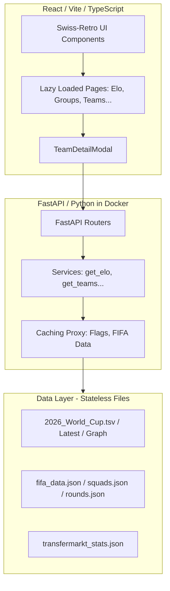

# 🏆 World Cup 2026 Dashboard - Proje Röntgeni & Durum Analiz Raporu

Bu rapor, **FollowTheWorldCup.com** projesinin mevcut teknik durumunu incelemek, mimarisini analiz etmek, MVP (Minimum Viable Product) düzeyini değerlendirmek, potansiyel darboğazları ve riskli alanları tespit etmek ve gelecek aşamalar için bir yol haritası sunmak amacıyla hazırlanmıştır.

---

## 🔎 1. Projenin Genel Röntgeni (Mimari Analiz)

Proje, modern **Swiss-Retro Fusion** tasarım dili temel alınarak geliştirilmiş, statik dosya önbellekleme (Caching-First) stratejisini kullanan yüksek performanslı bir Dünya Kupası 2026 tahmin ve güç sıralaması platformudur.

### 📐 Sistem Mimarisi


*   **Frontend (Sunum Katmanı):** React, Vite, TailwindCSS ve TypeScript kullanılarak inşa edilmiştir. İsviçre Tipografi stili (keskin köşeler, sıfır border-radius, kalın siyah gölgeler) ile retro arcade renk tonları (neon yeşil, neon camgöbeği, neon sarı) harmanlanarak premium bir kullanıcı deneyimi hedeflenmiştir.
*   **Backend (Servis Katmanı):** Docker konteyneri içinde koşan FastAPI tabanlı asenkron bir servistir. Üçüncü parti FIFA API servislerindeki kesintileri önlemek amacıyla **caching-first** proxy yapısı kurulmuştur.
*   **Veri Katmanı (Stateless Data):** Sistem tamamen dosya tabanlı (`.tsv` ve `.json`) veri işleme mantığıyla çalışmaktadır. ELO güç puanları (`eloratings.net` şeması), FIFA fikstür/squad bilgileri ve Transfermarkt finansal kadro değerleri tek bir akışta birleştirilmektedir.

---

## 📊 2. MVP Değerlendirmesi (Puan: 9 / 10)

Platformun mevcut haliyle bir **MVP (Minimum Viable Product)** olarak olgunluk derecesi **10 üzerinden 9**'dur.

### 🌟 9/10 Puanlama Gerekçeleri (Neden Çok Güçlü?)
1.  **Tam Entegre ELO & Kadro Analizi:** Dünya Kupası'ndaki 48 takımın tamamı için ELO güç puanları, peak dereceleri, tarihsel maç kazanma oranları ve Transfermarkt kadro değerleri kuruşu kuruşuna entegre edilmiştir. Sıfır değerli (0M€) veya verisi eksik hiçbir takım bulunmamaktadır.
2.  **Kusursuz Görsel Şölen (Swiss-Retro Fusion):** Pitch arka planı, neon animasyonlar, özel kupa ve güçskor göstergeleri, SVG tabanlı asenkron ELO gidişat sparkline grafiği arayüze premium bir hava katmaktadır.
3.  **Performans Optimizasyonları:** Sayfa bazlı kod bölme (Lazy Loading & Code Splitting) sayesinde tarayıcı yükleme hızı en üst düzeye çıkarılmıştır. CPU-heavy işlemler (arama, filtreleme, sıralama) `useMemo` ile sarmalanarak jank-free 60fps akıcılığa kavuşturulmuştur.
4.  **Bayrak Proxy Altyapısı:** FIFA flag API gecikmeleri, yerel diske otomatik sıkıştırarak önbellekleyen akıllı proxy router ile çözülmüştür (0ms görsel render süresi).
5.  **Standardizasyon (Normalization):** Bosnia, USA, Congo DR, Côte d'Ivoire gibi farklı kaynaklarda farklı yazılan tüm takım adları `normalizeName` algoritmasıyla arka planda tekilleştirilmiştir.

### 🚫 Eksik Kalan 1 Puan (Neden 10/10 Değil?)
*   **Veritabanı ve Kalıcılık Eksikliği:** Kullanıcıların maçlar üzerindeki skor tahminlerini kaydedebileceği veya Monte Carlo simülasyon sonuçlarının sunucu tarafında kalıcı olarak birikebileceği bir veritabanı (SQLite/PostgreSQL) katmanı henüz bağlanmamıştır. Sistem şu an tamamen okuma amaçlı (read-only) çalışmaktadır.

---

## ⚠️ 3. Potansiyel Sıkıntı ve Risk Oluşturabilecek Durumlar

Mevcut sistem stabil çalışıyor olsa da, gelecekte veya canlıya alım esnasında sorun oluşturabilecek noktalar şunlardır:

### A. Docker Konteyner Geliştirme/Güncelleme Döngüsü
*   **Risk:** Docker imajı oluşturulurken tüm kodlar (`app/`) konteynerin içine kopyalanmaktadır (`COPY app/ app/`). `docker-compose.yml` dosyasında sadece `./logs` dizini dışarıya bağlanmıştır.
*   **Sonuç:** Backend kodlarında yaptığınız değişiklikler (örn: `get_elo.py` güncellemesi) konteynere otomatik yansımaz. `docker-compose up --build -d` ile imajı baştan derlemek zorundasınız. Bu durum geliştirme hızını yavaşlatabilir.

### B. Senkron Dosya I/O Bloke Etme Riski (FastAPI Event-Loop)
*   **Risk:** `/api/v1/elo/ratings` veya `/api/v1/elo/team/.../form` çağrıldığında sunucu `open(ELO_RATINGS_FILE, "r")` komutuyla diske giderek senkron okuma yapmaktadır.
*   **Sonuç:** Düşük trafik altında bu işlem <5ms sürer ve hissedilmez. Ancak aynı anda yüzlerce kullanıcı siteye girdiğinde, bu senkron dosya okuma işlemleri FastAPI'nin tek çekirdekli asenkron event-loop'unu bloke ederek API yanıt sürelerinde (latency) şişmeye neden olabilir.

### C. Üçüncü Parti FIFA API Değişiklikleri
*   **Risk:** FIFA API proxy önbelleğimiz yerel JSON dosyalarına dayanır. Eğer yerel `fifa_data.json` veya `squads.json` dosyaları silinirse, backend ilk istekte online FIFA API'sine (`cxm-api.fifa.com`) sorgu atacaktır.
*   **Sonuç:** FIFA bu uç noktaları günceller veya şemayı değiştirirse, API'den gelen veriler ayrıştırılamayacak ve sistem çalışma zamanı (runtime) hatası verecektir.

---

## 🛠️ 4. Çözüm Önerileri ve Gelecek Yol Haritası

Projeyi kusursuzlaştırmak ve bir sonraki seviyeye taşımak için yapılması gereken geliştirmeler şunlardır:

### 🚀 Faz 1: Geliştirme Kolaylığı & Asenkron I/O (Hemen Yapılabilir)
1.  **Docker Volume Mount:** `docker-compose.yml` içerisine geliştirme ortamı için `/app` volume mount eklenmelidir. Böylece imajı sürekli rebuild etmeden kod değişiklikleri anında aktif olur:
    ```yaml
    volumes:
      - ./app:/app/app
      - ./logs:/app/logs
    ```
2.  **Thread-Pool Dosya Okuma (RAM Cache):** `get_elo.py` içerisindeki ağır TSV okuma operasyonları sunucu başlarken RAM belleğe yüklenmeli (RAM cache) ve sadece dosya değiştirildiğinde (mtime kontrolü ile) thread-pool üzerinden asenkron okunmalıdır (`anyio.to_thread.run_sync`).

### 💾 Faz 2: Veritabanı & Tahmin Katmanı (Orta Vade)
1.  **SQLite Entegrasyonu:** Projeye hafif ve sıfır-konfigürasyonlu bir SQLite veritabanı (`follow_the_world_cup.db`) entegre edilmelidir.
2.  **Kullanıcı Tahminleri (`/predictions`):** Kullanıcıların grup ve eleme aşamalarındaki skor tahminlerini veri tabanına kaydeden asenkron POST/GET uç noktaları oluşturulmalıdır.

### 🤖 Faz 3: Yapay Zeka Monte Carlo Simülatörü (Uzun Vade)
*   **Simülasyon Motoru:** `ai_simulation_engine_blueprint.md` içerisinde planlanan Monte Carlo simülasyon motoru kodlanmalıdır. ELO güç dengelerini, sakatlık verilerini ve ev sahibi avantajlarını hesaba katarak 10.000 kez turnuvayı simüle eden ve takımların şampiyonluk olasılıklarını canlı olarak güncelleyen yapı kurulmalıdır.

---

## 📌 Sonuç ve Genel Değerlendirme

**Follow Cup 2026**, görsel kalitesiyle, tipografi disipliniyle ve ELO/Transfermarkt verilerinin kusursuz birleşimiyle son derece başarılı, premium bir **Sunum ve Güç Sıralaması MVP'sidir**. 

Yapılan son veri standardizasyonu ve Docker derleme kontrolleriyle birlikte sistem şu an **en yüksek kararlılık seviyesindedir**. Veritabanı ve tahmin mekanizmaları eklendiğinde tam teşekküllü bir sosyal tahmin platformuna evrilmeye 100% hazırdır.
