# 🚂 Railway.app Hobi Planı Üretim Ortamı (Production) Uyumluluk Raporu

Bu rapor, "Follow The World Cup" monorepo projemizin Railway.app üzerinde 7/24 kesintisiz, performanslı ve güvenli bir şekilde çalışabilmesi için mevcut Docker ve klasör yapılandırmalarını analiz eder. 

Mevcut dosya yapılarımız incelenmiş, canlıya geçiş sürecinde **"CRASH"** veya derleme (build) hatalarına yol açabilecek kritik riskler ve optimizasyon fırsatları tespit edilmiştir.

---

## 📊 Genel Uyumluluk Skoru

```mermaid
gantt
    title Railway Canlıya Geçiş Hazırlık Durumu
    dateFormat  X
    axisFormat %s
    section Risk Analizi
    Dinamik Port ($PORT) Desteği : active, 0, 75
    Monorepo Root Yapılandırması : active, 0, 50
    Gereksiz .env Bağımlılığı (Kritik Blocker!) : crit, active, 0, 25
    Astral 'uv' Önbellek Verimliliği : active, 0, 60
```



> [!NOTE]
> Mevcut altyapımız yerel (Local) Docker Compose ortamında kusursuz çalışmak üzere tasarlanmıştır. Ancak Railway gibi modern bulut (Cloud PaaS) platformlarının dinamik kaynak atamaları ve geçici dosya sistemleri (ephemeral filesystem) nedeniyle canlı ortamda bazı kritik uyumsuzluklar barındırmaktadır.

---

## 🔍 Detaylı DevOps Kontrolleri & Analizler

### 1. Dinamik Port Kontrolü ($PORT)
> **Mevcut Durum:** Kısmen Uyumsuz ⚠️

* **Analiz:** `backend/Dockerfile` içinde `EXPOSE 8000` ve `CMD ["uvicorn", "app.main:app", "--host", "0.0.0.0", "--port", "8000", ...]` satırları yer almaktadır.
* **Risk Derecesi:** **Orta**
* **Açıklama:** Railway, her deployment sırasında container'a rastgele bir port atar ve bunu `$PORT` çevre değişkeni (environment variable) olarak içeriye enjekte eder. Container içindeki servis bu dinamik porta bağlanmak zorundadır. Mevcut `Dockerfile` statik olarak `8000` portuna kilitlendiği için, Railway yönlendiricisi (edge router) container ile iletişim kuramayabilir ve deployment **"Health Check Failed"** hatasıyla sonlanabilir.
* **Nokta Atışı Çözüm:** Dockerfile'daki `CMD` komutunu, Unix kabuğu (`sh -c`) aracılığıyla çalışacak şekilde güncelleyip `$PORT` değişkenini dinamik okumasını sağlamalıyız. `PORT` tanımlı değilse local uyumluluk için `8000` portuna fallback yapacaktır.
  ```dockerfile
  # Eski:
  CMD ["uvicorn", "app.main:app", "--host", "0.0.0.0", "--port", "8000", "--workers", "2"]
  
  # Yeni (Railway ve Local %100 Uyumlu):
  CMD ["sh", "-c", "uvicorn app.main:app --host 0.0.0.0 --port ${PORT:-8000} --workers 2"]
  ```

---

### 2. Monorepo ve Kök Dizin Yönetimi
> **Mevcut Durum:** Yapılandırma Eksik ⚠️

* **Analiz:** Projemiz `/backend` ve `/frontend` olmak üzere iki ana alt klasörden oluşan bir monorepodur. Dockerfile ve docker-compose dosyaları `/backend` dizini altındadır.
* **Risk Derecesi:** **Yüksek (Derleme Blokeri)**
* **Açıklama:** Railway projesini doğrudan GitHub deposuna bağladığımızda, platform varsayılan olarak kök dizinde (`/`) bir `Dockerfile` arar. Kök dizinde Dockerfile bulamadığı için build işlemi başlayamadan çökecektir.
* **Nokta Atışı Çözüm:** Kök dizine (`/`) bildirimsel bir `railway.toml` dosyası eklemek, bu sorunu tamamen çözen en elit yöntemdir. Bu dosya sayesinde Railway'e derleme bağlamının (build context) ve Dockerfile yolunun `/backend` olduğunu kodla söylemiş oluruz.

#### 📄 Önerilen Kök Dizin [railway.toml](file:///c:/Users/ozzenc/Desktop/follow_the_world_cup/railway.toml) Mimarisi:
```toml
[build]
builder = "DOCKER"
dockerfilePath = "backend/Dockerfile"
context = "backend"

[deploy]
restartPolicyType = "ON_FAILURE"
restartPolicyMaxRetries = 5
```

---

### 3. Bağımlılık Önbelleği (Build Cache) ve Astral 'uv'
> **Mevcut Durum:** Geliştirilebilir ⚡

* **Analiz:** `Dockerfile` içinde yüksek performanslı `uv` paket yöneticisi başarıyla kurulmuş ve sanal ortam yapılandırılmıştır. Ancak `uv.lock` dosyası derleme aşamasında Docker katmanına kopyalanmamaktadır (`COPY pyproject.toml .`).
* **Risk Derecesi:** **Düşük (Performans ve Güvenilirlik Kaybı)**
* **Açıklama:** 
  1. `uv.lock` dosyasının kopyalanmaması, üretim ortamında paketlerin en güncel sürümlerinin kontrolsüz indirilmesine sebep olur. Bu durum, yerelde çalışan kodun canlıda sürüm uyuşmazlığından çökmesine yol açabilir (Deterministic Build ihlali).
  2. Railway derleyicileri Docker Build önbelleğini destekler. `uv`'nin ultra hızlı paket yükleme önbelleğini korumak için Docker cache mount kullanılabilir.
* **Nokta Atışı Çözüm:** `Dockerfile` derleme aşamasında `uv.lock` dosyasını da içeri almalı ve `pip install` komutunu Docker cache mount ile hızlandırmalıyız:
  ```dockerfile
  # Eski:
  COPY pyproject.toml .
  RUN uv venv /opt/venv && \
      . /opt/venv/bin/activate && \
      uv pip install .

  # Yeni (Önbellek Dostu & Deterministik):
  COPY pyproject.toml uv.lock ./
  RUN uv venv /opt/venv && \
      . /opt/venv/bin/activate && \
      --mount=type=cache,target=/root/.cache/uv \
      uv pip install .
  ```

---

### 4. Kritik Canlıya Geçiş Engelleri (Blockers)
> **Mevcut Durum:** KRİTİK BLOKER TESPİT EDİLDİ! 🚨

#### 🚨 Blocker 1: `.env` Dosyasının İmaj İçine Kopyalanması (`COPY .env .env`)
* **Hata:** `backend/Dockerfile` satır 45'te `COPY .env .env` komutu yer alıyor.
* **Neden Blocker?** Local geliştirme ortamında `.env` dosyanız bulunuyor ancak bu dosya doğası gereği hassas veriler barındırır ve Git deponuza gönderilmez (veya gönderilmemelidir). Railway kodu Git'ten çekip imajı build etmeye başladığında **`.env` dosyasını bulamayacak ve Docker Build aşamasında `COPY failed: no such file or directory` hatası fırlatarak çökecektir.**
* **Çözüm:** Bu satırı `Dockerfile`'dan tamamen kaldırın. Backend mimarinizde yer alan `app/core/config.py` içerisindeki Pydantic `BaseSettings` yapısı, çevre değişkenlerini zaten doğrudan işletim sisteminden (ve dolayısıyla Railway Dashboard üzerinden tanımlayacağınız Env Variables kısmından) okumaktadır. Fiziksel bir `.env` dosyasının imaj içinde bulunmasına **KESİNLİKLE** gerek yoktur!

#### ⚠️ Risk 2: Geçici Dosya Sistemi ve Log Kaybı (Ephemeral Filesystem)
* **Hata:** `docker-compose.yml` içinde yer alan `- ./logs:/app/logs` volume bağlama mantığı Railway'de doğrudan çalışmaz.
* **Açıklama:** Railway container'ları "ephemeral" (geçici) çalışır. Container yeniden başladığında veya her yeni deploy yapıldığında `/app/logs` içindeki tüm log dosyalarınız silinir.
* **Çözüm:** Logların kalıcı olmasını istiyorsanız, Railway paneli üzerinden backend servisinize bir **"Railway Volume"** bağlamalı ve bunu `/app/logs` dizinine mount etmelisiniz. Bu işlem kod yazmayı gerektirmez, tamamen Railway arayüzü üzerinden yapılır.

---

## 🛠️ Nokta Atışı Önerilen Düzeltme Diffs (Daha Hızlı Deploy)

Aşağıdaki düzenlemeleri uygulayarak projenizi tek seferde ve sıfır hata ile Railway'de ayağa kaldırabilirsiniz.

### A. [backend/Dockerfile](file:///c:/Users/ozzenc/Desktop/follow_the_world_cup/backend/Dockerfile) Güncellemesi

```diff
- # Copy dependency manifests
- COPY pyproject.toml .
+ # Copy dependency manifests and deterministic lockfile
+ COPY pyproject.toml uv.lock ./
 
  # Create virtualenv and compile dependencies
  RUN uv venv /opt/venv && \
      . /opt/venv/bin/activate && \
-     uv pip install .
+     --mount=type=cache,target=/root/.cache/uv \
+     uv pip install .
 
  # ...
 
- # In production, we pass env variables instead of physical .env files,
- # but we bundle the .env file as a fallback for local running ease
- COPY .env .env
- 
  # Create empty folder for file logging persistence
  RUN mkdir -p logs
 
- EXPOSE 8000
- 
- # Run FastAPI app with standardized Production server settings
- CMD ["uvicorn", "app.main:app", "--host", "0.0.0.0", "--port", "8000", "--workers", "2"]
+ # Run FastAPI app with dynamic port binding fallback
+ CMD ["sh", "-c", "uvicorn app.main:app --host 0.0.0.0 --port ${PORT:-8000} --workers 2"]
```

### B. Kök Dizine Yeni [railway.toml](file:///c:/Users/ozzenc/Desktop/follow_the_world_cup/railway.toml) Ekleme

Bu dosya monorepo yönlendirmesini otomatik yaparak manuel panel ayarı yapma yükünü ortadan kaldırır.

```toml
[build]
builder = "DOCKER"
dockerfilePath = "backend/Dockerfile"
context = "backend"

[deploy]
restartPolicyType = "ON_FAILURE"
restartPolicyMaxRetries = 5
```

---

## 📋 Canlıya Alım (Deployment) Kontrol Listesi

1. **[ ]** `backend/Dockerfile` üzerindeki `.env` kopyalama satırını silin ve dinamik port yönlendirmesini ekleyin.
2. **[ ]** Deponun kök dizinine (Root) `railway.toml` dosyasını oluşturun.
3. **[ ]** Railway Dashboard -> `follow_the_world_cup` projesi oluşturun.
4. **[ ]** **Variables** (Çevre Değişkenleri) sekmesine gelerek `.env` dosyanızdaki kritik değişkenleri (`GEMINI_API_KEY`, `ENVIRONMENT=production`, vb.) Railway paneline elle girin.
5. **[ ]** Log kalıcılığı istiyorsanız, backend servisine Railway üzerinden bir Volume ekleyin ve mount yolunu `/app/logs` olarak ayarlayın.
6. **[ ]** GitHub deponuzu bağlayıp Deploy tuşuna basın! 🚀
