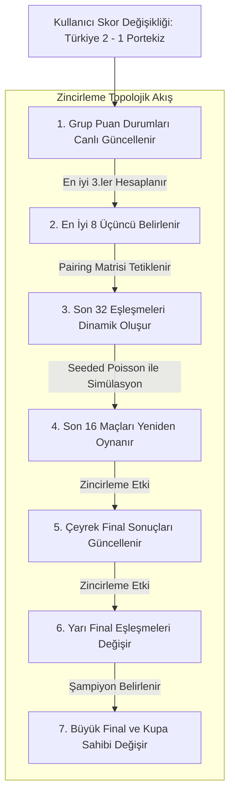

# 🏆 Dünya Kupası 2026 Simülasyon Motoru (TournamentEngine) Matematiksel ve Mantıksal Çalışma Rehberi

Bu döküman, **FollowTheWorldCup.com** projesinin en karmaşık ve hassas mekanizması olan saf TypeScript simülasyon motorunun (`TournamentEngine.ts`) ve onunla bütünleşik asenkron veri yönetim modelinin (`useTournamentStore.ts` & `get_elo.py`) çalışma prensiplerini detaylı bir matematiksel ve mantıksal çerçevede açıklar. 

Sistemimiz, rastgele sayılar üreten basit bir şans makinesi değil; futbol gerçekliği faktörlerini (bireysel yıldız gücü, kupa tarihi pedigrisi, turnuva aşaması baskısı, ev sahibi motivasyonu ve taktiksel form) olasılık teorisinin en saygın modellerinden **Poisson Gol Beklentisi** ile harmanlayan hibrit bir analitik simülatördür.

---

## 📐 1. Kompozit Güç Puanı (CSR - Composite Strength Rating) Hesaplaması

Simülasyon motoru, iki ülkenin gücünü karşılaştırırken sadece ham FIFA sıralaması veya anlık ELO puanlarını temel almaz. Futbolun çok parametreli doğasını temsil etmek amacıyla, takımların teknik, finansal, tarihsel ve coğrafi avantajlarını birleştiren **Kompozit Güç Puanı (CSR)** değerini dinamik olarak hesaplar.

### 🔹 CSR Matematiksel Formülü:
Her milli takım için aktif turnuva aşamasına göre hesaplanan $CSR$ puanı, aşağıdaki 4 parametrenin ağırlıklı toplamından oluşur (Ev Sahibi Paradoksu gereği seyirci motivasyonu bu taktiksel puanlama zemininden ayrıştırılmıştır):

$$\text{CSR} = 0.55 \times R_{\text{Elo}} + 0.20 \times R_{\text{Kadro}} + 0.10 \times R_{\text{DNA}} + 0.05 \times R_{\text{Momentum}}$$

---

### 🔹 Parametrelerin Teknik Detayları ve Beslendiği Kaynaklar:

#### A. Temel Teknik Güç ($R_{\text{Elo}}$ - Ağırlık: %55)
*   **Veri Kaynağı:** `2026_World_Cup_latest.tsv` dosyasındaki güncel ELO puanı (`team.rating`).
*   **Çalışma Mantığı:** Takımın uluslararası aremadaki güncel teknik kalitesini ve taktiksel istikrarını temsil eden ana katsayıdır. CSR hesaplamasının omurgasını oluşturur.

#### B. Kadro Derinliği ve Yıldız Gücü ($R_{\text{Kadro}}$ - Ağırlık: %20)
*   **Veri Kaynağı:** `transfermarkt_stats.json` dosyasındaki kadro piyasa değeri (`team.squadValue` - Milyon Euro bazında).
*   **Çalışma Mantığı:** Futbolda kadro değeri ile güç ilişkisi doğrusal değildir. Logaritmik kavis sayesinde, kadro değerlerindeki aşırı uçurumlar törpülenir, ancak yıldız oyuncuların bireysel yetenek farkı ve yedek kulübesi derinliği simülasyona tam kıvamında etki eder:
    $$R_{\text{Kadro}} = 100 \times \log_{10}(\text{squadValue} + 1)$$

#### C. Turnuva DNA'sı ($R_{\text{DNA}}$ - Ağırlık: %10)
*   **Veri Kaynağı:** `fifa_data.json` içindeki Dünya Kupası katılım sayısı (`team.appearances`) ve `winners.json` içindeki şampiyonluk yılı verileri (`team.championships` & `team.championshipDnaScore`).
*   **⏳ Uruguay Paradoksu (Zaman Çürümesi - Time Decay):**
    Sıradan sistemlerde eski Dünya Kupası şampiyonlukları (örn: 1930) ile günümüz şampiyonlukları (örn: 2022) takıma aynı DNA ağırlığını verir. Bu tarihsel adaletsizliği önlemek için şampiyonluklar sayılırken yıl bazlı bir **DNA Zaman Çürümesi** uygulanır:
    *   **1990 ve Sonrası Şampiyonluklar:** Takıma kupa başına **$+25$** DNA puanı kazandırır.
    *   **1990 Öncesi Şampiyonluklar:** Takıma kupa başına **$+5$** DNA puanı kazandırır.
    
    Bu sayede takımların taban DNA gücü şu formülle hesaplanır (maksimum 150 puanla sınırlandırılmıştır):
    $$\text{Taban DNA} = \min(150, \, 5 \times \text{appearances} + \text{championshipDnaScore})$$
*   **Dinamik Turnuva Çarpanı (DNA Escalation):** Turnuvada aşamalar ilerledikçe kupa DNA'sının çarpan etkisi katlanır:
    *   **Grup Aşaması (GROUP):** $\text{Taban DNA} \times 1.0$
    *   **Son 32 / Son 16 (R32 / R16):** $\text{Taban DNA} \times 1.5$
    *   **Çeyrek Final / Yarı Final / Final (QF / SF / F):** $\text{Taban DNA} \times 2.0$

#### D. Form ve Momentum ($R_{\text{Momentum}}$ - Ağırlık: %5)
*   **Veri Kaynağı:** TSV verilerindeki son 1 yıllık ELO değişim puanı (`team.oneYearRatingChange`).
*   **Çalışma Mantığı:** Takımın son 1 yılda yükselen bir grafik mi çizdiğini yoksa çöküşte mi olduğunu belirler. Artı veya eksi yöndeki bu değişim doğrudan eklenerek form durumu simüle edilir.

---

## 🥅 2. Gol Beklentisi ($\lambda$ - Lambda) Hesaplaması

İki takım karşı karşıya geldiğinde skorlar rassal bir kura ile değil, futbol istatistik dünyasının altın standardı olan **Poisson Dağılım Modeli** ile üretilir. Poisson dağılımını besleyen en kritik girdi, takımların o maçta atmaları beklenen gol sayısını temsil eden **Lambda ($\lambda$)** katsayılarıdır.

### 🔹 Temel Gol Beklentisi Formülleri:
Her maç için takımların tarihsel maç başı attıkları/yedikleri gol ortalamaları (`goalsForAvg` ve `goalsAgainstAvg` - TSV dosyasından gelir) ile aralarındaki CSR farkı kullanılarak A ve B takımları için gol beklentileri ($\lambda$) hesaplanır:

$$\lambda_A = \text{goalsForAvg}_A \times \text{goalsAgainstAvg}_B \times \left(1 + \frac{\text{CSR}_A - \text{CSR}_B}{1000}\right)$$

$$\lambda_B = \text{goalsForAvg}_B \times \text{goalsAgainstAvg}_A \times \left(1 + \frac{\text{CSR}_B - \text{CSR}_A}{1000}\right)$$

---

### 🔹 Gol Beklentisini Etkileyen Dinamik Realizm Filtreleri:

Simülasyon motoru, yukarıdaki temel formüle ek olarak, gerçek futbol dinamiklerini yansıtmak üzere Lambda değerlerini şu filtrelerden geçirir:

#### 1. Ev Sahibi Paradoksu (Decoupled Crowd Motivation - Çarpan: %15)
*   Ev sahibi ülkelere (ABD, Meksika, Kanada) verilen doğrudan $+100$ ELO puanı bonusu, bu takımları yapay birer deve dönüştürerek rakiplere haksız "Aura" cezaları veriyordu.
*   **Çözüm:** Ev sahibi bonusu CSR formülünden tamamen silinmiştir. Bunun yerine taraftar coşkusu doğrudan gol beklentisine (Lambda) **%15** oranında çarpan olarak eklenir:
    $$\text{Eğer } teamA.hostTeam = \text{true} \implies \lambda_A = \lambda_A \times 1.15$$
    $$\text{Eğer } teamB.hostTeam = \text{true} \implies \lambda_B = \lambda_B \times 1.15$$

#### 2. Türkiye Paradoksu (Modern Dominasyon Zemin Filtresi - Floor: 2.0)
*   Form grafiği yüksek ama geçmiş tarihsel istatistikleri zayıf olan takımlar (Örn: Türkiye), turnuvadaki çok zayıf rakiplere (Örn: Haiti) karşı simülatörde tarihsel gol ortalaması engeli yüzünden yeterince gol üretemiyordu.
*   **Çözüm:** İki takım arasındaki CSR farkı **400 puandan büyükse** (`diffCSR > 400`), favori takımın Lambda gol beklentisi, kendi tarihsel gol ortalamalarına bakılmaksızın **asgari 2.0** gol seviyesine yükseltilir:
    $$\text{Eğer } CSR_A - CSR_B > 400 \implies \lambda_A = \max(\lambda_A, \, 2.0)$$
    $$\text{Eğer } CSR_B - CSR_A > 400 \implies \lambda_B = \max(\lambda_B, \, 2.0)$$
    Bu zemin filtreleme (floor) işlemi, lambdaların en son `[0.25, 4.25]` arasına sıkıştırılmasından hemen önce çalıştırılır.

#### 3. Deviren Bonusu (Underdog Motivation)
*   CSR farkı $> 250$ olan maçlarda, formu yükselişte olan zayıf takıma geçici olarak **$+50$** CSR motivasyon bonusu verilir.

#### 4. Şişirilmiş İstatistik Filtresi (Fake Stats Normalization)
*   İki takım arasındaki CSR farkı **300'den büyükse**, zayıf takımın maç başı gol ortalaması (`goalsForAvg`) en fazla **1.1** olarak sınırlandırılır.

#### 5. Devlerin Aurası (Juggernaut Modifier)
*   Baz ELO puanı **2000'in üzerinde** olan dev rakiplere karşı oynayan takımların gol beklentisi ($\lambda$) doğrudan **%15** oranında düşürülür (rakip katsayısı $\times 0.85$).

#### 6. Altın Jenerasyon Bonusu (Golden Generation / Wonderkids)
*   Yaş ortalaması genç (`averageAge < 27`) ve kadro kalitesi yüksek (`squadValue > 300M €`) olan takımların gol beklentisi ($\lambda$) doğrudan **%10** artırılır (katsayı $\times 1.10$).

#### 7. Efsanelerin Zırhı (Elite Plot Armor - Knockout Penalty)
*   Eleme turlarında, baz ELO puanı **2000 ve üzerinde** olan elit devler karşısındaki tecrübesiz rakiplerin (CSR farkı $> 200$) gol beklentisi ($\lambda$) doğrudan **%20** oranında baltalanır (rakip katsayısı $\times 0.80$).

#### 8. Sahne Korkusu (Stage Fright Penalty)
*   Çok zayıf bir takım (baz ELO $< 1650$), turnuvanın süper devlerinden biriyle (baz ELO $> 1950$) eşleştiğinde zayıf takımın gol beklentisi ($\lambda$) doğrudan **%50** oranında düşürülür (katsayı $\times 0.50$).

#### 9. Büyük Maç Baskısı (Variance Dampening)
*   Çeyrek Final, Yarı Final ve Final (QF, SF, F) gibi aşamalarda her iki takımın da gol beklentisi ($\lambda$) doğrudan **%25** oranında kısılır (her iki katsayı $\times 0.75$).

#### 📊 Lambda Sınırlandırma Aralığı (Lambda Bounding):
*   Tüm filtreler uygulandıktan sonra, nihai Lambda ($\lambda$) değerleri **`0.25`** ile **`4.25`** aralığına zorla sıkıştırılır:
    $$\lambda = \max(0.25, \, \min(4.25, \, \lambda))$$

---

## 🎲 3. Knuth Poisson Algoritması ve Kesin Skor Sınırları

Gol beklentileri ($\lambda$) belirlendikten sonra, takımların maçta atacağı gol sayıları olasılık teorisindeki Poisson Dağılım formülünü simüle eden **Knuth Algoritması** kullanılarak hesaplanır.

*   Gol sayısı, Dünya Kupası tarihindeki en uçuk skorların dahi temsil edilebilmesi için en fazla **8 gol** ile sınırlandırılır (`Math.min(8, score)`).
*   **Kesin Gol Sınırı Filtresi (Ultimate Score Cap):** CSR farkı $> 350$ ise, zayıf takımın şans eseri atabileceği maksimum gol sayısı mantıksal olarak **en fazla 1 gol** olacak şekilde kesin olarak kilitlenir:
    $$\text{Eğer } CSR_A - CSR_B > 350 \implies \text{awayScore} = \min(1, \, \text{awayScore})$$
*   **Eleme Turlarında Beraberlik Bozucu:** Skor berabere biterse takımların CSR farkından bir galibiyet olasılık indeksi ($p_A$) türetilir:
    $$p_A = \frac{1}{1 + 10^{-\frac{\text{CSR}_A - \text{CSR}_B}{400}}}$$
    PRNG değeri $p_A$'dan küçükse Ev Sahibi A takımına, büyükse Deplasman B takımına ekstra 1 gol eklenerek (simüle edilmiş uzatma/penaltı golü) kazanan belirlenir.

---

## 🎲 4. Seeded Mulberry32 PRNG (Tekrarlanabilir Olasılık)

Kullanıcının her sayfa yenilemesinde tamamen farklı ve mantıksız sonuçlar görerek simülatöre olan inancını kaybetmesini önlemek amacıyla, deterministik ve tohumlanabilir **Mulberry32 PRNG (Pseudo-Random Number Generator)** kullanılmıştır.

*   Varsayılan tohum (seed) değeri **`2026`**'dır ve her sayfa yenilemede sonuçların kararlı bir biçimde birebir aynı kalmasını sağlar.
*   **🎲 TAHMİNİ YENİLE (Paralel Evrenler):** Kullanıcı bu butona bastığında, tamamen yeni ve rastgele bir tohum değeri (örn. `74129`) seçilir ve futbolun doğasındaki sürprizleri ve farklı senaryoları barındıran **yeni ve kararlı bir paralel evren** simüle edilir.

---

## 🔄 5. Zincirleme Cascade (Topological Ripple) Akışı

Kullanıcı arayüzde herhangi bir maça elle müdahale ettiğinde (skoru override ettiğinde), bu değişiklik turnuvanın geleceğine doğru topolojik bir dalga şeklinde anlık olarak yayılır:

### 🔹 Uç Durum (Edge-Case) Güvenlik Mekanizmaları:
1.  **En İyi Üçüncüler Eşitlik Çözücü:** 12 gruptan en iyi 8 üçüncü seçilirken sırasıyla: **Puan $\rightarrow$ Net Averaj $\rightarrow$ Atılan Gol $\rightarrow$ CSR Güç Katsayısı** kriterlerine bakılır. Her şey eşitse, rastgele kura yerine daha güçlü olan (yüksek CSR'lı) takım üst tura geçirilir.
2.  **Override Reset Mekanizması:** Kullanıcı daha önce Son 16'daki bir maçı override etmişse ve ardından geriye dönüp grup aşamasında yaptığı değişiklik nedeniyle o Son 16 maçının eşleşen takımları değişmişse; sistem eski geçersiz override'ı otomatik olarak **sessizce sıfırlar (reset)** ve yeni takımlarla deterministik Poisson simülasyonunu baştan çalıştırır.
