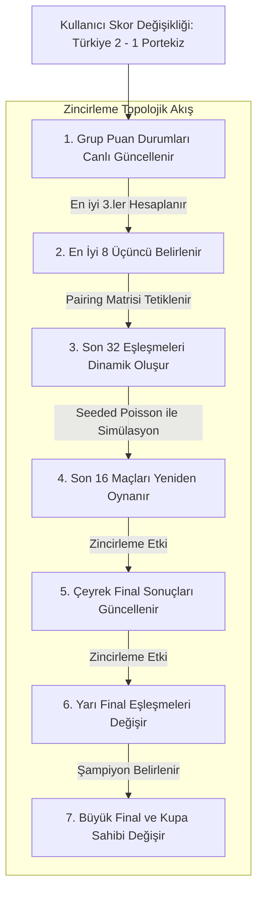

# 🏆 Dünya Kupası 2026 Simülasyon Motoru (TournamentEngine) Matematiksel ve Mantıksal Çalışma Rehberi

Bu döküman, **FollowTheWorldCup.com** projesinin matematiksel ve mantıksal kalbi olan, tarayıcı tarafında (client-side) sıfır gecikmeyle çalışan saf TypeScript simülasyon motorunun (`TournamentEngine.ts`) ve durum yönetiminin (`useTournamentStore.ts`) nasıl çalıştığını, hangi parametreleri aldığını ve bunları nasıl işlediğini detaylıca açıklar.

---

## 📐 1. Kompozit Güç Puanı (CSR - Composite Strength Rating) Hesaplaması

Simülasyon motoru, takımların güçlerini sadece ham FIFA sıralaması veya ELO puanı ile değerlendirmez. Bunun yerine, futbol gerçekliğini (ev sahibi avantajı, kadro derinliği, tarihsel başarı, anlık form) yansıtan **Kompozit Güç Puanı (CSR)** hesaplar.

### 🔹 CSR Matematiksel Formülü:
 Takımın gücü ($CSR$), aşağıdaki 5 farklı parametrenin ağırlıklı birleşimiyle hesaplanır:

$$\text{CSR} = 0.55 \times R_{\text{Elo}} + 0.20 \times R_{\text{Kadro}} + 0.10 \times R_{\text{DNA}} + 0.05 \times R_{\text{Momentum}} + 0.10 \times R_{\text{EvSahibi}}$$

---

### 🔹 Formüldeki Parametrelerin Ayrıntılı Çalışma Mantığı:

#### A. Temel Teknik Güç ($R_{\text{Elo}}$ - Ağırlık: %55)
*   **Aldığı Veri:** `2026_World_Cup_latest.tsv` dosyasındaki güncel Elo puanı.
*   **Çalışma Mantığı:** Takımın uluslararası maçlardaki güncel teknik kalitesini temsil eden ana katsayıdır. CSR puanının omurgasını oluşturur.

#### B. Finansal Derinlik & Yıldız Gücü ($R_{\text{Kadro}}$ - Ağırlık: %20)
*   **Aldığı Veri:** `transfermarkt_stats.json` dosyasındaki kadro piyasa değeri (`squadValue` - Milyon € bazında).
*   **Çalışma Mantığı:** Kadro kalitesi güce doğrusal yansımaz. Örneğin kadro değeri 1.2 Milyar € olan İngiltere, 12 Milyon € olan bir takımdan doğrusal olarak 100 kat güçlü değildir. Bu uçurumu adil bir şekilde dengelemek için **Logaritmik Ölçekleme** uygulanır:
    $$R_{\text{Kadro}} = 100 \times \log_{10}(\text{squadValue} + 1)$$
    Bu sayede yıldız oyuncuların yedek kulübesi derinliği ve bireysel yetenek farkı simülasyona gerçekçi bir oranda eklenir.

#### C. Turnuva DNA'sı ($R_{\text{DNA}}$ - Ağırlık: %10)
*   **Aldığı Veri:** `fifa_data.json` içindeki turnuva katılım sayısı (`appearances`) ve `winners.json` içindeki şampiyonluk sayısı (`championships`).
*   **Çalışma Mantığı:** Dünya Kupası dev bir baskı sahnesidir. Brezilya, Arjantin, Almanya gibi kupa pedigrisi olan devlerin stres altında oynama tecrübesi bu parametre ile CSR'a eklenir (maksimum 150 puanla sınırlandırılmıştır):
    $$R_{\text{DNA}} = \min(150, \, 5 \times \text{appearances} + 25 \times \text{championships})$$

#### D. Form ve Momentum ($R_{\text{Momentum}}$ - Ağırlık: %5)
*   **Aldığı Veri:** `oneYearRatingChange` (Son 1 yıldaki ELO değişimi).
*   **Çalışma Mantığı:** Takımın son 1 yılda yükselişte mi yoksa çöküşte mi olduğunu gösterir. Artı veya eksi değer doğrudan eklenerek form durumu simüle edilir.

#### E. Ev Sahibi Bonusu ($R_{\text{EvSahibi}}$ - Ağırlık: %10)
*   **Aldığı Veri:** `hostTeam` boolean alanı (`true`/`false`).
*   **Çalışma Mantığı:** 2026 Dünya Kupası ev sahipleri olan **ABD, Meksika ve Kanada** kendi seyircileri önünde oynadıkları için onlara doğrudan $+100$ ELO puanı değerinde moral/saha avantajı bonusu eklenir.

---

## 🥅 2. Gol Beklentisi ve Poisson Dağılımı ile Skor Üretimi

İki takım (A ve B) karşılaştığında kazananı belirlemek için bir yazı-tura veya basit random kura çalıştırılmaz. Bunun yerine futbol analiz dünyasının standart kabul ettiği **Poisson Dağılımı** modeli uygulanır.

### 🔹 Gol Beklentisi ($\lambda$ - Lambda) Hesaplaması:
Her maç için takımların tarihsel maç başı attıkları/yedikleri gol ortalamaları (`goalsForAvg` ve `goalsAgainstAvg`) ile CSR farkı çarpılarak o maça özel beklenen gol sayısı ($\lambda$) hesaplanır:

$$\lambda_A = \text{goalsForAvg}_A \times \text{goalsAgainstAvg}_B \times \left(1 + \frac{\text{CSR}_A - \text{CSR}_B}{1000}\right)$$

$$\lambda_B = \text{goalsForAvg}_B \times \text{goalsAgainstAvg}_A \times \left(1 + \frac{\text{CSR}_B - \text{CSR}_A}{1000}\right)$$

*   **Sınırlandırma (Bounding):** Beklenmeyen absürt durumları engellemek için takımların gol beklentileri ($\lambda$) matematiksel olarak en düşük **`0.25`** ve en yüksek **`4.25`** aralığına sıkıştırılır.

---

### 🔹 Poisson ve Sınırlandırma (Truncation) Algoritması:
Poisson olasılık formülü ($P(X=k) = \frac{\lambda^k e^{-\lambda}}{k!}$) kullanılarak Knuth Algoritması yardımıyla takımların atacağı gol sayıları rassal olarak üretilir.

*   **Truncated Poisson (Max 6 Gol):** Standart Poisson teorik olarak sonsuza kadar gol üretebilir. Ancak hem tarayıcı RAM'ini şişirmemek hem de futbol gerçekliğine uymayan absürt skorları (Örn: 15-0) engellemek için her takımın atabileceği maksimum gol sayısı **6 gol** ile sınırlandırılmıştır (`Math.min(6, score)`).

---

### 🔹 Eleme Turlarında Eşitlik Çözücü (Penaltı & Uzatmalar):
Grup aşamasında beraberlik mümkünken, Eleme Turlarında (Son 32, Son 16 vb.) bir kazanan olmak zorundadır. Maç berabere biterse:
*   Takımların CSR farkından bir galibiyet olasılık indeksi ($p_A$) çıkarılır:
    $$p_A = \frac{1}{1 + 10^{-\frac{\text{CSR}_A - \text{CSR}_B}{400}}}$$
*   PRNG üzerinden üretilen değer $p_A$'dan küçükse Ev Sahibi, büyükse Deplasman takımına ekstra 1 gol eklenerek (simüle edilmiş uzatma/penaltı golü) tur atlayan belirlenir.

---

## 🎲 3. Seeded Mulberry32 PRNG (Tekrarlanabilir Olasılık)

Kullanıcının her sayfa yenilemesinde tamamen kaotik sonuçlar görüp inandırıcılık kaybı yaşamaması için **Mulberry32 Sözde-Rastgele Sayı Üreticisi (PRNG)** entegre edilmiştir.

### 🔹 Neden Standart `Math.random()` Kullanmadık?
`Math.random()` tohum (seed) kabul etmez ve her saniye tamamen farklı bir rastgelelik üretir. Bu da simülasyonu mantıksız bir slot makinesine çevirirdi.

### 🔹 Mulberry32 Çalışma Mantığı:
*   Simülasyon motoru varsayılan olarak **`2026`** tohumuyla (seed) çalıştırılır.
*   Bu tohum değeri, bit düzeyinde matematiksel formüllerle (`imul` katsayıları ve bit kaydırmaları) kararlı ve tekrarlanabilir bir rastgele sayı dizisi üretir:
    ```typescript
    let t = (seedValue += 0x6d2b79f5);
    t = Math.imul(t ^ (t >>> 15), t | 1);
    t ^= t + Math.imul(t ^ (t >>> 7), t | 61);
    return ((t ^ (t >>> 14)) >>> 0) / 4294967296;
    ```
*   **Sonuç:** Sayfa kaç kere yenilenirse yenilensin, `2026` tohumu kullanıldığı sürece maç sonuçları **birebir aynı** kalır. ELO'su yüksek devler mantıklı bir şekilde gruptan çıkar.
*   **Paralel Evrenler (🎲 TAHMİNİ YENİLE):** Kullanıcı bu butona bastığında rastgele yeni bir tohum (Örn: `72491`) üretilir. ELO katsayıları yine aynı kalır ancak Mulberry32 rastgele dizisi değiştiği için, futbolun doğasındaki kararlı sürprizler içeren **farklı ama yine kendi içinde son derece mantıklı** yeni bir turnuva ağacı simüle edilir.

---

## 🔄 4. Zincirleme Cascade (Topological Ripple) Etkisi

Kullanıcı arayüzde herhangi bir maçın skorunu değiştirdiğinde (override), turnuva ağacı geleceğe doğru anlık olarak tekrardan oynatılır.



### 🔹 Uç Durum (Edge-Case) Güvenlik Filtreleri:
1.  **Strict 3rd-Place Tie-Breakers (En İyi 3.ler Kabusu):** 48 takımlı yeni formatta 12 gruptan en iyi 8 üçüncü seçilmek zorundadır. Sıralama motoru şu kriterleri katı bir sıra ile kontrol eder:
    $$\text{Puan} \rightarrow \text{Net Averaj (GD)} \rightarrow \text{Atılan Gol} \rightarrow \text{CSR Güç Katsayısı Fallback}$$
    Eğer tüm istatistikler eşitse, rastgele kura çekmek yerine **CSR katsayısı yüksek olan (güçlü olan) takım** üst tura geçirilir.
2.  **Override Reset Mekanizması:** Örneğin siz Son 16'da `İspanya - Hırvatistan` maçını override ettiniz ve Hırvatistan'ı üst tura çıkardınız. Daha sonra grup aşamasına gidip bir skoru değiştirdiniz ve İspanya'nın Son 16'daki rakibi Hırvatistan yerine İtalya oldu. 
    *   *Mekanizma:* Sistem, Son 16 eşleşmesinde takımların değiştiğini anlar, eski Hırvatistan override'ını **güvenli bir şekilde sıfırlar** ve İspanya - İtalya maçını tohumlu Poisson ile tertemiz baştan oynatır. Böylece hayalet takımların finallerde oynaması engellenir.

---

## 💾 5. Zustand Store Entegrasyonu ve Performans

*   **Toplu İşleme (Batching):** Zustand store, tüm veri birleştirme ve simülasyon adımlarını tek bir state güncellemesinde toplu (batch) olarak yapar.
*   **0ms Gecikme:** Saf TypeScript motoru, 104 maçın tamamının oynatılması dahil tüm cascade zincirini tarayıcıda **1 milisaniyenin altında** hesaplar. Main-thread bloke olmaz, arayüzde donma veya takılma yaşanmaz.
