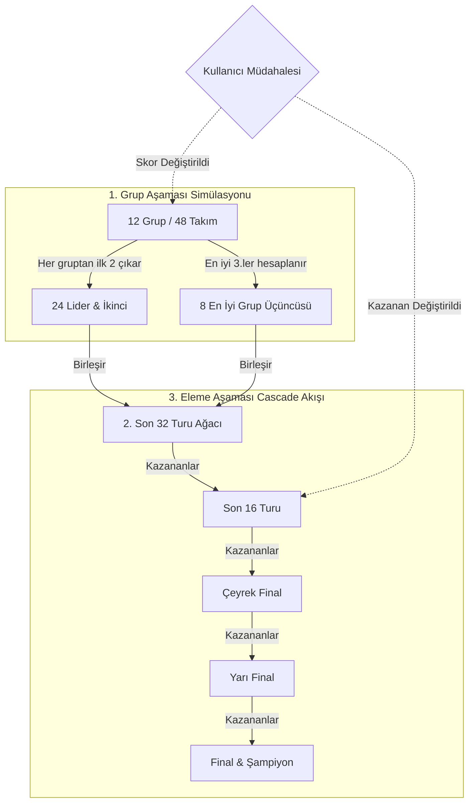

# 🎮 World Cup 2026 Tournament Cascade Simulator - Matematiksel ve Mimari Tasarım Planı

Bu plan, **FollowTheWorldCup.com** üzerinde kullanıcıların Dünya Kupası 2026'yı başından sonuna kadar matematiksel olarak en gerçekçi ağırlıklarla simüle edebileceği, maç sonuçlarına elle müdahale ettiğinde geleceğe doğru tüm turnuva ağacının anlık olarak yeniden hesaplanıp (cascade ripple effect) değişeceği interaktif bir **turnuva simülasyon oyunu** tasarımıdır.

---

## 💾 1. Elimizdeki Verilerin Ayrıntılı Listesi (Data Ecosystem)

Turnuva simülatörünün arkasındaki matematiksel motoru besleyecek son derece güçlü ve zengin veri katmanlarımız mevcuttur. Bu verilerin listesi ve simülasyondaki kullanım alanları şu şekildedir:

| Veri Dosyası | Veri Alanı | Temsil Ettiği Güç Parametresi |
|---|---|---|
| **2026_World_Cup.tsv** | `rating` | **Temel Teknik Güç:** Takımın güncel gücünü gösteren ana ELO değeri. |
| | `oneYearRatingChange` | **Momentum / Form:** Takımın son 1 yılda yükselişte mi yoksa çöküşte mi olduğunu gösterir. |
| | `peakRating` / `avgRating` | **Tarihsel İstikrar:** Takımın geçmiş tavan seviyesi ve genel güç kararlılığı. |
| | `winRate` | **Kazanma Alışkanlığı:** Takımın tarihsel maç kazanma yüzdesi. |
| | `goalsForAvg` / `goalsAgainstAvg` | **Hücum ve Savunma Katsayısı:** Poisson modelinde gol beklentisini ($\lambda$) hesaplamada kullanılır. |
| **transfermarkt_stats.json**| `squadValue` (Milyon €) | **Finansal Derinlik & Yıldız Gücü:** Kadro derinliği, yedek kalitesi ve bireysel yetenek çarpanı. |
| | `averageAge` | **Turnuva Olgunluğu:** Yaş ortalaması (optimum 26-28 yaş tecrübe sağlar; çok yüksek yaş yorgunluk, çok düşük yaş tecrübesizlik üretir). |
| **fifa_data.json** | `appearances` | **Dünya Kupası DNA'sı:** Takımın turnuva geçmişi, stres altında oynama tecrübesi. |
| | `hostTeam` | **Ev Sahibi Avantajı:** 2026'da ABD, Meksika ve Kanada için devalar bir ELO / moral çarpanı sağlar. |
| **winners.json** | `championships` (Şampiyonluklar) | **Şampiyonluk Pedigrisi:** Kupa kazanma geni (Örn: Brezilya, Arjantin, Almanya gibi takımlara finallerde ek psikolojik çarpan). |
| **2026_World_Cup_fixtures.tsv**| `t1Prob` / `t2Prob` / `drawProb` | **ELO Tabanlı Baseline Olasılıklar:** Matematiksel modelimizin kalibrasyonu için referans olasılık seti. |

---

## 📐 2. Matematiksel Model: Kompozit Güç Puanı (Composite Strength Rating - CSR)

Bir maçın sonucunu sadece ham ELO puanı ile tahmin etmek turnuva gerçekliğine uymaz. Bu yüzden her takım için tüm veri bileşenlerini ağırlıklandıran bir **Kompozit Güç Puanı (CSR)** formüle edeceğiz.

### CSR Hesaplama Formülü

$$\text{CSR} = 0.55 \times R_{\text{Elo}} + 0.20 \times R_{\text{Kadro}} + 0.10 \times R_{\text{DNA}} + 0.05 \times R_{\text{Momentum}} + 0.10 \times R_{\text{EvSahibi}}$$

#### Alt Güç Bileşenlerinin Tanımları:
1.  **Base Elo Gücü ($R_{\text{Elo}}$):** Güncel ELO reytingi doğrudan alınır.
2.  **Kadro Değeri Çarpanı ($R_{\text{Kadro}}$):** Kadro değeri doğrusal artmaz, bu yüzden logaritmik ölçekleme kullanılır:
    $$R_{\text{Kadro}} = 100 \times \log_{10}(\text{squadValue} + 1)$$
    *(Örn: 1.2 Milyar € kadrosu olan İngiltere ile 800M€ kadrosu olan Fransa arasındaki fark adil dengelenir).*
3.  **Kupa DNA Skoru ($R_{\text{DNA}}$):** Tarihsel tecrübe ve şampiyonlukların etkisi (maksimum 150 puanla sınırlandırılır):
    $$R_{\text{DNA}} = \min(150, \, 5 \times \text{appearances} + 25 \times \text{championships})$$
4.  **Takım Momenti ($R_{\text{Momentum}}$):** Son 1 yıllık ELO değişimi doğrudan eklenir (pozitif veya negatif etki):
    $$R_{\text{Momentum}} = \text{oneYearRatingChange}$$
5.  **Ev Sahibi Bonusu ($R_{\text{EvSahibi}}$):** Eğer `hostTeam` değeri `true` ise takıma $+100$ ELO puanı eklenir.

---

### 🥅 3. Gol Tahmin Modeli: Poisson Dağılımı ile Skor Üretimi

İki takım (A ve B) karşılaştığında maçın sadece kazananını değil, **tam skorunu (2-1, 1-0 vb.)** simüle etmek için **Poisson Dağılımı** kullanacağız.

1.  **Takımların Gol Beklentilerinin ($\lambda$) Hesaplanması:**
    *   Takım A'nın beklenen gol sayısı ($\lambda_A$):
        $$\lambda_A = \text{goalsForAvg}_A \times \text{goalsAgainstAvg}_B \times \left(1 + \frac{\text{CSR}_A - \text{CSR}_B}{1000}\right)$$
    *   Takım B'nin beklenen gol sayısı ($\lambda_B$):
        $$\lambda_B = \text{goalsForAvg}_B \times \text{goalsAgainstAvg}_A \times \left(1 + \frac{\text{CSR}_B - \text{CSR}_A}{1000}\right)$$
2.  **Skor Olasılık Matrisinin Çıkarılması:**
    Poisson formülüyle her iki takımın da $0, 1, 2, 3, 4, 5+$ gol atma olasılıkları hesaplanır:
    $$P(X = k) = \frac{\lambda^k e^{-\lambda}}{k!}$$
    *   Örnek: $P_A(2 \text{ gol}) \times P_B(1 \text{ gol}) = \text{Maçın } 2-1 \text{ bitme ihtimali}$.
3.  **Simülasyon Çözücü (Simulation Solver):**
    *   **Grup Aşamasında:** Olasılık matrisinden rastgele bir skor seçilir (Beraberlik mümkündür).
    *   **Eleme Aşamasında:** Beraberlik çıkarsa, CSR farkına göre uzatmalar ve penaltılar simüle edilerek bir kazanan belirlenir.

---

## 🔄 4. Turnuva Döngüsü ve "Cascade" (Dalgalanma) Algoritması

Simülatör tamamen dinamik bir **Durum Ağacı (State Tree)** olarak tasarlanacaktır.

### Turnuva Akış Adımları:
1.  **Varsayılan Durum (Default Run):** Kullanıcı sayfayı ilk açtığında, matematiksel Poisson modelimiz arka planda 48 takımlı grup aşamasını ve eleme ağacını **en yüksek olasılıklı skorlarla** tek seferde oynatır. Sistem "Kupayı Kim Kazanacak?" sorusunun varsayılan yanıtını ve favoriyi (Örn: İspanya veya Fransa) ekran kartı detaylarıyla gösterir.
2.  **Grup Üçüncülerinin Hesaplanması:** 12 gruptaki tüm simüle edilmiş maçlar bittiğinde; puan, averaj ve atılan gol kıstaslarına göre **en iyi 8 grup üçüncüsü** dinamik olarak seçilir ve Son 32 turuna yerleştirilir.
3.  **Dinamik Cascade Zinciri (Ripple Effect):**
    *   Tüm eleme maçları, kendilerinden önceki maçların **kazanan düğümlerine (parent nodes)** bağlıdır.
    *   *Örnek:* Eğer kullanıcı grup aşamasındaki `Türkiye 0 - 2 Portekiz` simülasyon skoruna tıklayıp bunu `Türkiye 2 - 1 Portekiz` olarak değiştirirse:
        1.  Grup F puan tablosu anlık olarak yeniden hesaplanır.
        2.  Türkiye gruptan 2. olarak çıkar (Portekiz 3.lüğe geriler).
        3.  Son 32 turundaki eşleşmeler **dinamik olarak güncellenir** (Türkiye başka bir grubun birincisiyle eşleşir).
        4.  Eşleşmesi değişen tüm Son 32 maçları **arka planda CSR ve Poisson modelimizle otomatik olarak yeniden simüle edilir**.
        5.  Bu yeni simülasyon sonuçları Son 16, Çeyrek Final ve Final maçlarını **zincirleme olarak (cascade)** tetikler, yeni kazananları hesaplar ve tüm şampiyona ağacını saniyeler içinde günceller!
    *   Kullanıcı direkt Son 16'daki bir eşleşmeye tıklayıp *"Almanya elendi, onun yerine İsviçre turladı"* derse, Çeyrek Finaldeki rakibi İsviçre olur ve Çeyrek Final maçı İsviçre'nin CSR değerleriyle arka planda otomatik yeniden oynatılır.

---

## 🛠️ 5. Geliştirme Yol Haritası ve Teknoloji Seçimi

Bu interaktif oyunu tamamen **İstemci Tarafında (Client-Side React / TypeScript)** çalışacak şekilde tasarlayacağız. Bu sayede sıfır sunucu gecikmesi, sıfır bütçe maliyeti ve eşsiz bir animasyonlu oynanış elde edeceğiz.

1.  **Dinamik State Yönetimi:** Turnuva maçlarını `matchesState` adlı tek bir React/Redux veya Zustand state'inde tutacağız. Her maçın `isOverridden`, `simulatedScore`, `userScore` ve `winner` alanları olacak.
2.  **Simülasyon Çözücü Sınıfı (`TournamentEngine.ts`):** Tüm CSR ve Poisson hesaplamalarını yapıp turnuvayı başından sonuna oynatan saf TypeScript sınıfı yazılacak.
3.  **UI Tasarımı:** İsviçre retro stiline uygun, tıklanabilir fikstür kartları, grup tablolarında canlı sıra değişim animasyonları ve eleme aşamasında parlayan neon bağlantı çizgileri (bracket connectors) kullanılacak.
